# Component Interaction Architecture - SolarVoice AI Platform

## Overview

This document details the interaction patterns between all major components in the SolarVoice AI platform. It covers synchronous and asynchronous communication patterns, event flows, and data exchange protocols between services.

## Component Overview

### Core Platform Components

## Component Interaction Patterns

### 1. Voice Command Processing Interaction

### 2. Real-time WebSocket Interactions

### 3. CrewAI Agent Coordination

### 4. Database Interaction Patterns

### 5. External Service Integration Flow

## Event-Driven Architecture

### 1. Event Bus Architecture

### 2. Event Flow Examples

#### Safety Incident Event Flow

#### Equipment Request Event Flow

## Microservice Communication Patterns

### 1. Synchronous Communication

```mermaid
graph TD
    subgraph "API Gateway"
        GW[Gateway]
        LB[Load Balancer]
        CB[Circuit Breaker]
    end
    
    subgraph "Service Mesh"
        SM[Service Mesh]
        SD[Service Discovery]
        HC[Health Check]
    end
    
    subgraph "Services"
        S1[Service 1]
        S2[Service 2]
        S3[Service 3]
    end
    
    GW --> LB
    LB --> CB
    CB --> SM
    
    SM --> SD
    SD --> HC
    
    HC --> S1
    HC --> S2
    HC --> S3
```

### 2. Asynchronous Communication

## State Management

### 1. Distributed State Management

### 2. Session State Flow

## Data Synchronization Patterns

### 1. Multi-Region Sync

### 2. Cache Synchronization

## Error Handling and Recovery

### 1. Cascading Failure Prevention

### 2. Compensation Transaction Pattern

## Performance Optimization Interactions

### 1. Request Batching

### 2. Read Replica Routing

## Summary

The component interaction architecture of SolarVoice AI demonstrates:

1. **Loose Coupling**: Services communicate through well-defined interfaces
2. **High Cohesion**: Related functionality is grouped within services
3. **Resilience**: Multiple fallback mechanisms prevent cascading failures
4. **Scalability**: Horizontal scaling through load balancing and sharding
5. **Performance**: Optimized interaction patterns minimize latency
6. **Flexibility**: Event-driven architecture enables easy extension
7. **Observability**: All interactions are monitored and traceable

This architecture ensures that the platform can handle the complex requirements of solar construction management while maintaining high performance and reliability.