# Integration Architecture - SolarVoice AI Platform

## Overview

This document provides comprehensive documentation of all integration points in the SolarVoice AI platform, including external APIs, third-party services, and internal service integrations.

## Integration Landscape

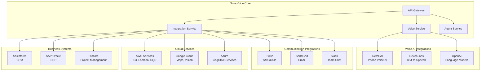
```mermaid
graph TB
    subgraph "SolarVoice Core"
        API[API Gateway]
        VS[Voice Service]
        IS[Integration Service]
        AS[Agent Service]
    end
    
    subgraph "Voice AI Integrations"
        RT[Retell AI<br/>Phone Voice AI]
        EL[ElevenLabs<br/>Text-to-Speech]
        OAI[OpenAI<br/>Language Models]
    end
    
    subgraph "Communication Integrations"
        TW[Twilio<br/>SMS/Calls]
        SG[SendGrid<br/>Email]
        SLK[Slack<br/>Team Chat]
    end
    
    subgraph "Cloud Services"
        AWS[AWS Services<br/>S3, Lambda, SQS]
        GCP[Google Cloud<br/>Maps, Vision]
        AZ[Azure<br/>Cognitive Services]
    end
    
    subgraph "Business Systems"
        CRM[Salesforce<br/>CRM]
        ERP[SAP/Oracle<br/>ERP]
        PM[Procore<br/>Project Management]
    end
    
    API --> VS
    API --> IS
    API --> AS
    
    VS --> RT
    VS --> EL
    VS --> OAI
    
    IS --> TW
    IS --> SG
    IS --> SLK
    
    IS --> AWS
    IS --> GCP
    IS --> AZ
    
    IS --> CRM
    IS --> ERP
    IS --> PM
```

## Voice AI Integrations

### 1. Retell AI Integration

#### Purpose
Enables phone-based voice interactions for field workers who need hands-free communication.

#### Integration Architecture

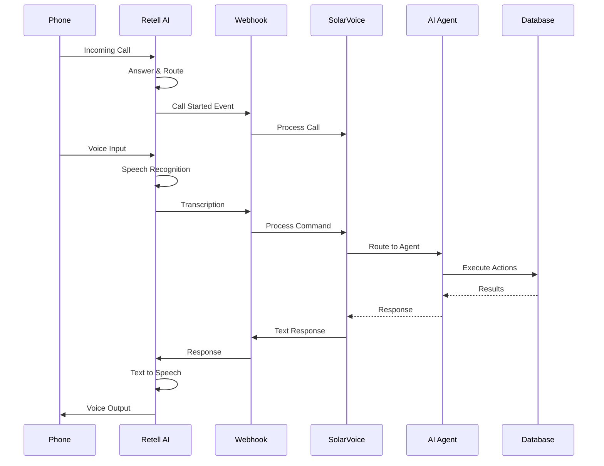
```mermaid
sequenceDiagram
    participant P as Phone
    participant R as Retell AI
    participant W as Webhook
    participant S as SolarVoice
    participant A as AI Agent
    participant D as Database
    
    P->>R: Incoming Call
    R->>R: Answer & Route
    R->>W: Call Started Event
    W->>S: Process Call
    
    P->>R: Voice Input
    R->>R: Speech Recognition
    R->>W: Transcription
    W->>S: Process Command
    S->>A: Route to Agent
    A->>D: Execute Actions
    D-->>A: Results
    A-->>S: Response
    S->>W: Text Response
    W->>R: Response
    R->>R: Text to Speech
    R->>P: Voice Output
```

#### Configuration

```typescript
interface RetellConfig {
  apiKey: string;
  webhookUrl: string;
  agents: {
    emergency: { id: string; phoneNumber: string };
    customerService: { id: string; phoneNumber: string };
    siteCoordination: { id: string; phoneNumber: string };
    technicalSupport: { id: string; phoneNumber: string };
  };
  voiceSettings: {
    speed: number;
    pitch: number;
    stability: number;
    clarity: number;
  };
}
```

#### Key Features
- Real-time phone call handling
- Multi-agent support with specialized prompts
- Emergency hotline with priority routing
- Call recording and transcription
- Webhook-based event handling

### 2. ElevenLabs Integration

#### Purpose
Provides natural, emotion-aware text-to-speech capabilities for voice responses.

#### Integration Flow

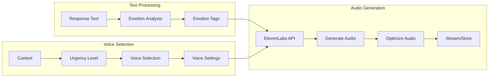
```mermaid
flowchart LR
    subgraph "Text Processing"
        TXT[Response Text]
        EMO[Emotion Analysis]
        TAG[Emotion Tags]
    end
    
    subgraph "Voice Selection"
        CTX[Context]
        URG[Urgency Level]
        VOI[Voice Selection]
        SET[Voice Settings]
    end
    
    subgraph "Audio Generation"
        API[ElevenLabs API]
        GEN[Generate Audio]
        OPT[Optimize Audio]
        STR[Stream/Store]
    end
    
    TXT --> EMO
    EMO --> TAG
    
    CTX --> URG
    URG --> VOI
    VOI --> SET
    
    TAG --> API
    SET --> API
    API --> GEN
    GEN --> OPT
    OPT --> STR
```

#### Voice Configuration

```typescript
interface VoiceProfile {
  voiceId: string;
  name: string;
  personality: string;
  useCase: string[];
  emotionSettings: {
    urgency: { stability: number; similarity: number; style: number };
    professional: { stability: number; similarity: number; style: number };
    empathetic: { stability: number; similarity: number; style: number };
  };
}

const voiceProfiles: VoiceProfile[] = [
  {
    voiceId: 'EXAVITQu4vr4xnSDxMaL',
    name: 'Bella',
    personality: 'Professional and reassuring',
    useCase: ['customer_service', 'general_inquiries'],
    emotionSettings: {
      urgency: { stability: 0.8, similarity: 1.0, style: 0.8 },
      professional: { stability: 0.5, similarity: 0.75, style: 0.5 },
      empathetic: { stability: 0.6, similarity: 0.8, style: 0.7 }
    }
  },
  {
    voiceId: 'VR6AewLTigWG4xSOukaG',
    name: 'Josh',
    personality: 'Authoritative and clear',
    useCase: ['emergency', 'safety_alerts'],
    emotionSettings: {
      urgency: { stability: 0.9, similarity: 1.0, style: 0.9 },
      professional: { stability: 0.7, similarity: 0.85, style: 0.6 },
      empathetic: { stability: 0.6, similarity: 0.75, style: 0.6 }
    }
  }
];
```

### 3. OpenAI Integration (via CrewAI)

#### Purpose
Powers the intelligent agent system with advanced language understanding and generation.

#### Integration Pattern

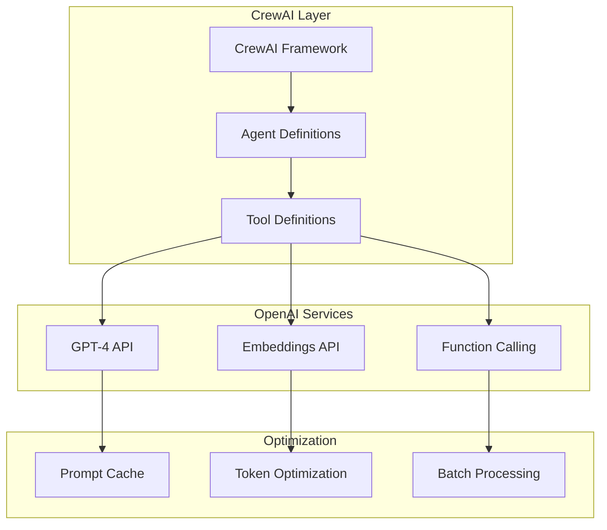
```mermaid
graph TD
    subgraph "CrewAI Layer"
        CA[CrewAI Framework]
        AGT[Agent Definitions]
        TLS[Tool Definitions]
    end
    
    subgraph "OpenAI Services"
        GPT[GPT-4 API]
        EMB[Embeddings API]
        FUN[Function Calling]
    end
    
    subgraph "Optimization"
        PRM[Prompt Cache]
        TOK[Token Optimization]
        BAT[Batch Processing]
    end
    
    CA --> AGT
    AGT --> TLS
    
    TLS --> GPT
    TLS --> EMB
    TLS --> FUN
    
    GPT --> PRM
    EMB --> TOK
    FUN --> BAT
```

## Communication Integrations

### 1. Twilio Integration

#### Purpose
Enables SMS notifications, emergency calls, and two-way messaging.

#### Communication Flow

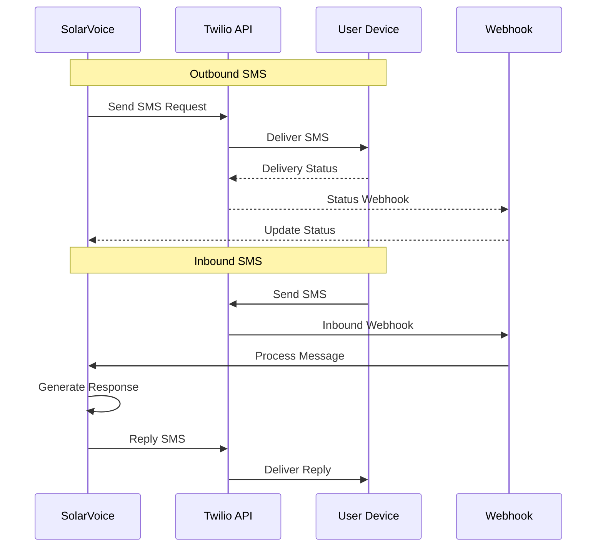
```mermaid
sequenceDiagram
    participant S as SolarVoice
    participant T as Twilio API
    participant U as User Device
    participant W as Webhook
    
    Note over S,U: Outbound SMS
    S->>T: Send SMS Request
    T->>U: Deliver SMS
    U-->>T: Delivery Status
    T-->>W: Status Webhook
    W-->>S: Update Status
    
    Note over S,U: Inbound SMS
    U->>T: Send SMS
    T->>W: Inbound Webhook
    W->>S: Process Message
    S->>S: Generate Response
    S->>T: Reply SMS
    T->>U: Deliver Reply
```

#### Use Cases
- Emergency notifications to all site workers
- Daily safety reminders
- Schedule updates and changes
- Two-way communication for remote workers
- Equipment delivery confirmations

### 2. SendGrid Integration

#### Purpose
Handles all email communications including reports, alerts, and customer communications.

#### Email Types

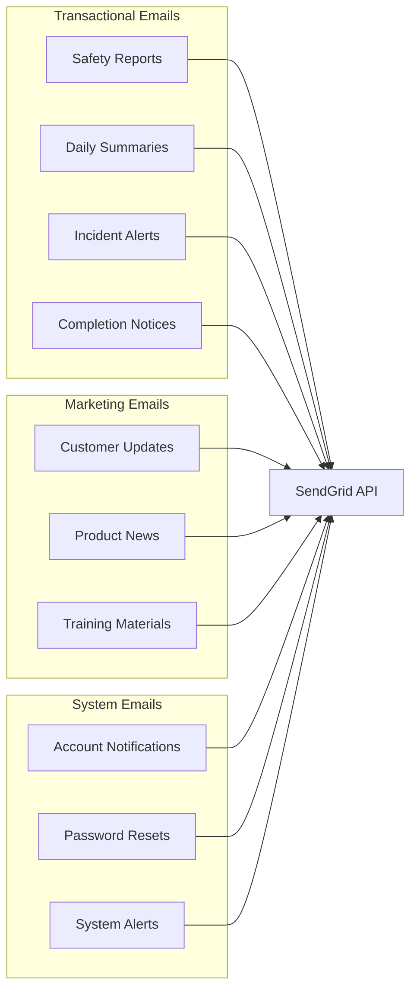
```mermaid
graph LR
    subgraph "Transactional Emails"
        T1[Safety Reports]
        T2[Daily Summaries]
        T3[Incident Alerts]
        T4[Completion Notices]
    end
    
    subgraph "Marketing Emails"
        M1[Customer Updates]
        M2[Product News]
        M3[Training Materials]
    end
    
    subgraph "System Emails"
        S1[Account Notifications]
        S2[Password Resets]
        S3[System Alerts]
    end
    
    T1 --> SG[SendGrid API]
    T2 --> SG
    T3 --> SG
    T4 --> SG
    
    M1 --> SG
    M2 --> SG
    M3 --> SG
    
    S1 --> SG
    S2 --> SG
    S3 --> SG
```

### 3. Slack Integration

#### Purpose
Provides real-time team communication and system notifications.

#### Integration Architecture

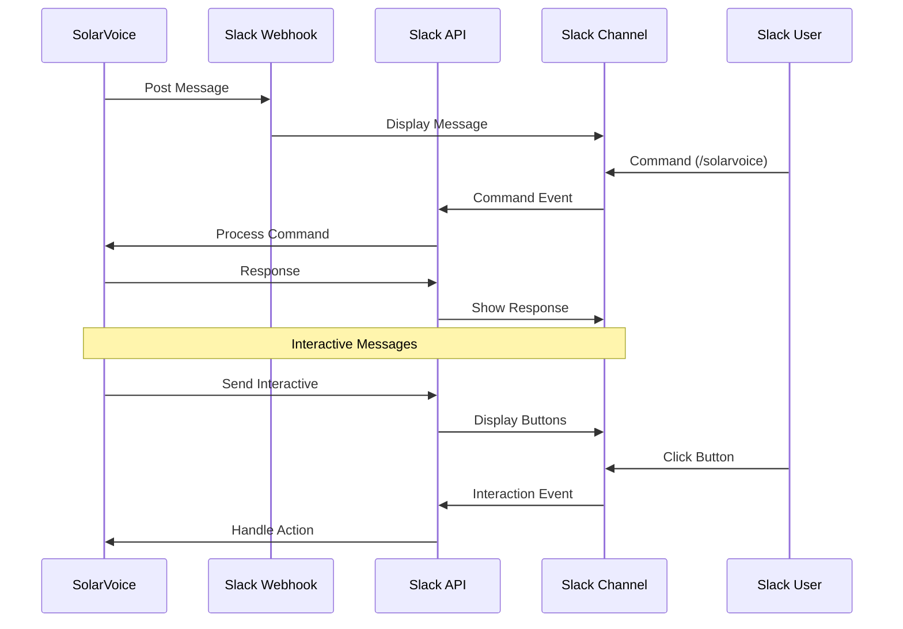
```mermaid
sequenceDiagram
    participant SV as SolarVoice
    participant SW as Slack Webhook
    participant SA as Slack API
    participant SC as Slack Channel
    participant SU as Slack User
    
    SV->>SW: Post Message
    SW->>SC: Display Message
    
    SU->>SC: Command (/solarvoice)
    SC->>SA: Command Event
    SA->>SV: Process Command
    SV->>SA: Response
    SA->>SC: Show Response
    
    Note over SV,SC: Interactive Messages
    SV->>SA: Send Interactive
    SA->>SC: Display Buttons
    SU->>SC: Click Button
    SC->>SA: Interaction Event
    SA->>SV: Handle Action
```

## Cloud Service Integrations

### 1. AWS Services Integration

#### S3 Integration

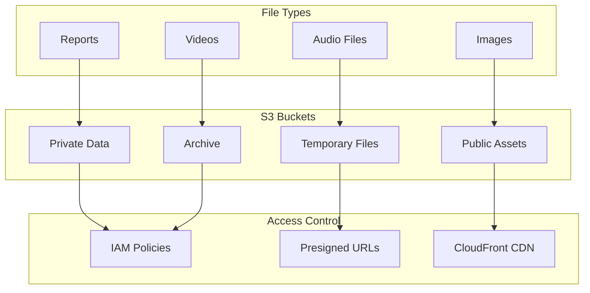
```mermaid
flowchart TD
    subgraph "File Types"
        AU[Audio Files]
        RP[Reports]
        IM[Images]
        VD[Videos]
    end
    
    subgraph "S3 Buckets"
        PUB[Public Assets]
        PRV[Private Data]
        TMP[Temporary Files]
        ARC[Archive]
    end
    
    subgraph "Access Control"
        IAM[IAM Policies]
        PRE[Presigned URLs]
        CDN[CloudFront CDN]
    end
    
    AU --> TMP
    RP --> PRV
    IM --> PUB
    VD --> ARC
    
    PUB --> CDN
    PRV --> IAM
    TMP --> PRE
    ARC --> IAM
```

#### Lambda Integration

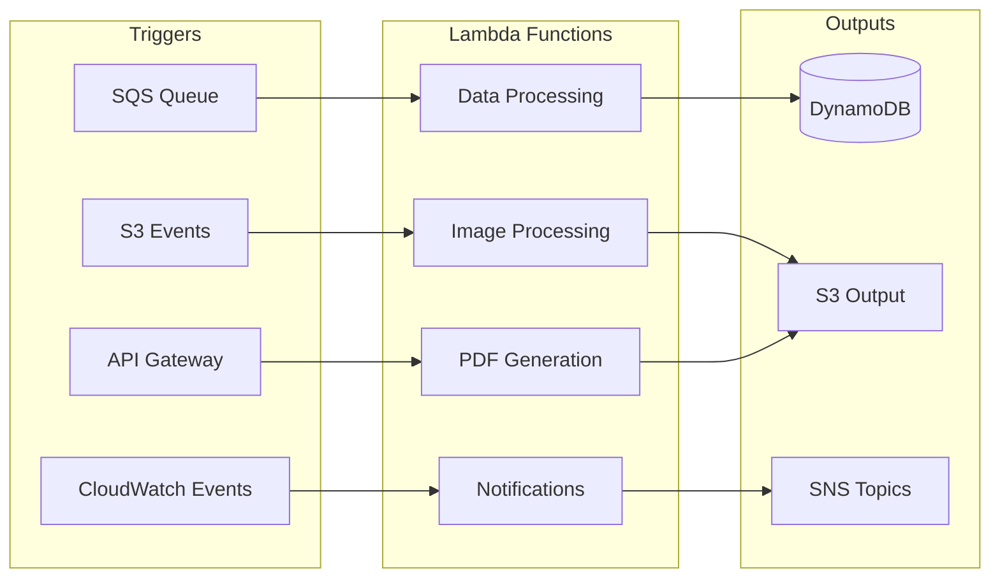
```mermaid
graph LR
    subgraph "Triggers"
        S3E[S3 Events]
        API[API Gateway]
        SQS[SQS Queue]
        CWE[CloudWatch Events]
    end
    
    subgraph "Lambda Functions"
        IMG[Image Processing]
        PDF[PDF Generation]
        DAT[Data Processing]
        NOT[Notifications]
    end
    
    subgraph "Outputs"
        DB[(DynamoDB)]
        S3O[S3 Output]
        SNS[SNS Topics]
    end
    
    S3E --> IMG
    API --> PDF
    SQS --> DAT
    CWE --> NOT
    
    IMG --> S3O
    PDF --> S3O
    DAT --> DB
    NOT --> SNS
```

### 2. Google Cloud Integration

#### Maps API Integration

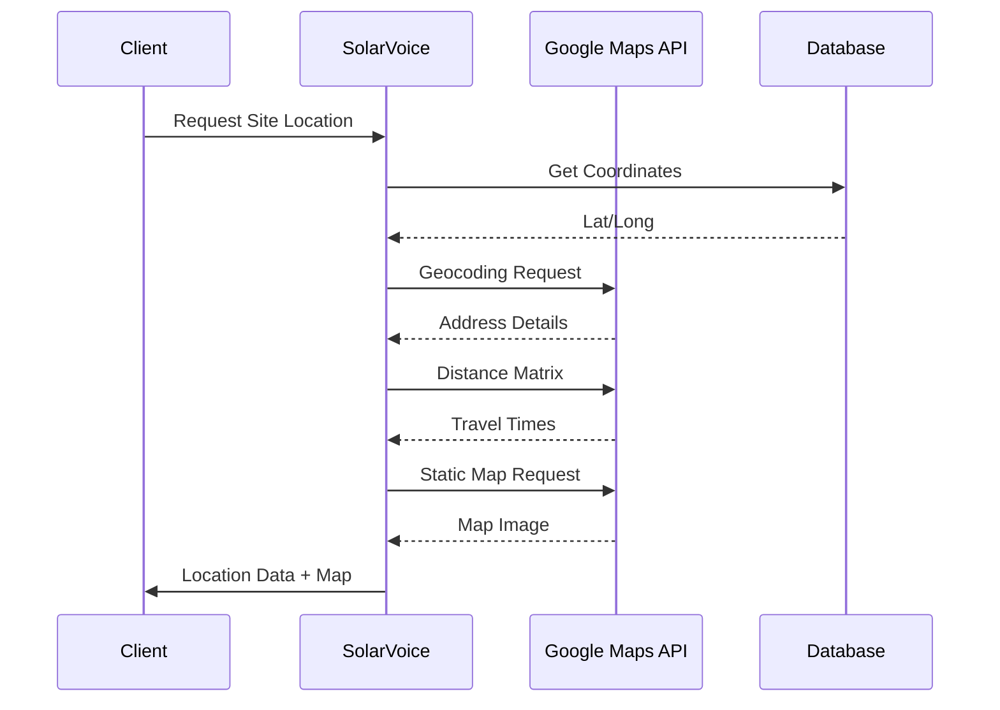
```mermaid
sequenceDiagram
    participant C as Client
    participant S as SolarVoice
    participant G as Google Maps API
    participant D as Database
    
    C->>S: Request Site Location
    S->>D: Get Coordinates
    D-->>S: Lat/Long
    
    S->>G: Geocoding Request
    G-->>S: Address Details
    
    S->>G: Distance Matrix
    G-->>S: Travel Times
    
    S->>G: Static Map Request
    G-->>S: Map Image
    
    S->>C: Location Data + Map
```

#### Vision API Integration

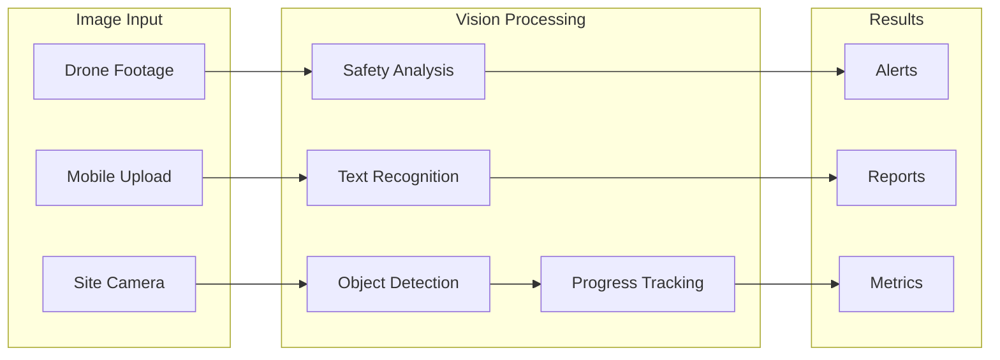
```mermaid
flowchart LR
    subgraph "Image Input"
        CAM[Site Camera]
        MOB[Mobile Upload]
        DRN[Drone Footage]
    end
    
    subgraph "Vision Processing"
        DET[Object Detection]
        TXT[Text Recognition]
        SAF[Safety Analysis]
        PRG[Progress Tracking]
    end
    
    subgraph "Results"
        ALT[Alerts]
        RPT[Reports]
        MET[Metrics]
    end
    
    CAM --> DET
    MOB --> TXT
    DRN --> SAF
    
    DET --> PRG
    TXT --> RPT
    SAF --> ALT
    PRG --> MET
```

## Business System Integrations

### 1. CRM Integration (Salesforce)

#### Data Synchronization

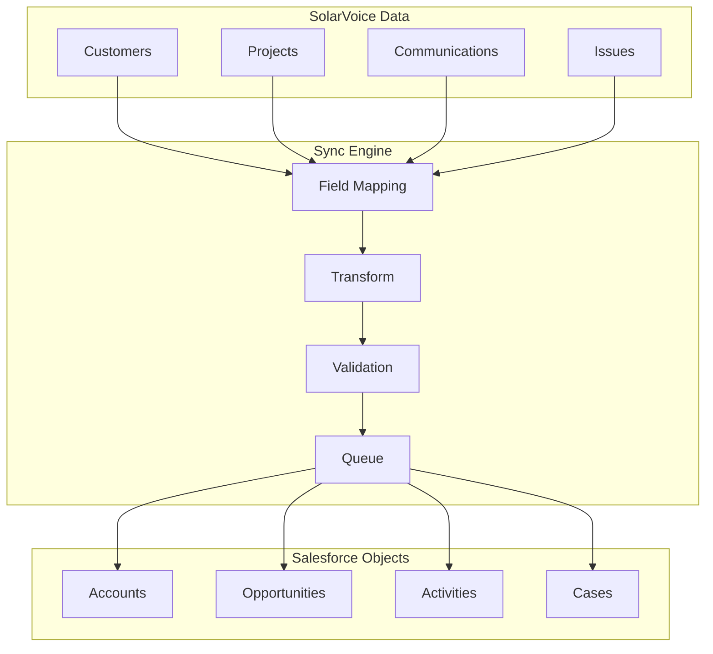
```mermaid
graph TB
    subgraph "SolarVoice Data"
        SV_CUST[Customers]
        SV_PROJ[Projects]
        SV_COMM[Communications]
        SV_ISSU[Issues]
    end
    
    subgraph "Sync Engine"
        MAP[Field Mapping]
        TRN[Transform]
        VAL[Validation]
        QUE[Queue]
    end
    
    subgraph "Salesforce Objects"
        SF_ACC[Accounts]
        SF_OPP[Opportunities]
        SF_ACT[Activities]
        SF_CAS[Cases]
    end
    
    SV_CUST --> MAP
    SV_PROJ --> MAP
    SV_COMM --> MAP
    SV_ISSU --> MAP
    
    MAP --> TRN
    TRN --> VAL
    VAL --> QUE
    
    QUE --> SF_ACC
    QUE --> SF_OPP
    QUE --> SF_ACT
    QUE --> SF_CAS
```

### 2. ERP Integration

#### Integration Pattern

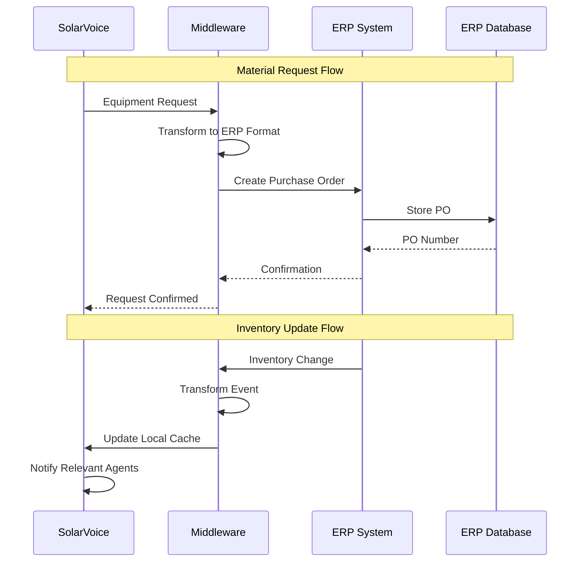
```mermaid
sequenceDiagram
    participant SV as SolarVoice
    participant MW as Middleware
    participant ERP as ERP System
    participant DB as ERP Database
    
    Note over SV,DB: Material Request Flow
    
    SV->>MW: Equipment Request
    MW->>MW: Transform to ERP Format
    MW->>ERP: Create Purchase Order
    ERP->>DB: Store PO
    DB-->>ERP: PO Number
    ERP-->>MW: Confirmation
    MW-->>SV: Request Confirmed
    
    Note over SV,DB: Inventory Update Flow
    
    ERP->>MW: Inventory Change
    MW->>MW: Transform Event
    MW->>SV: Update Local Cache
    SV->>SV: Notify Relevant Agents
```

### 3. Project Management Integration (Procore)

#### Bidirectional Sync

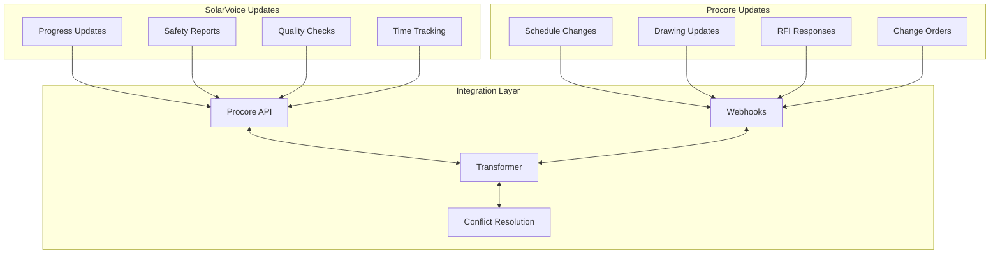
```mermaid
flowchart TD
    subgraph "SolarVoice Updates"
        SV1[Progress Updates]
        SV2[Safety Reports]
        SV3[Quality Checks]
        SV4[Time Tracking]
    end
    
    subgraph "Integration Layer"
        API[Procore API]
        WH[Webhooks]
        TR[Transformer]
        CF[Conflict Resolution]
    end
    
    subgraph "Procore Updates"
        PC1[Schedule Changes]
        PC2[Drawing Updates]
        PC3[RFI Responses]
        PC4[Change Orders]
    end
    
    SV1 --> API
    SV2 --> API
    SV3 --> API
    SV4 --> API
    
    API <--> TR
    WH <--> TR
    TR <--> CF
    
    PC1 --> WH
    PC2 --> WH
    PC3 --> WH
    PC4 --> WH
```

## Integration Security

### 1. API Security Model

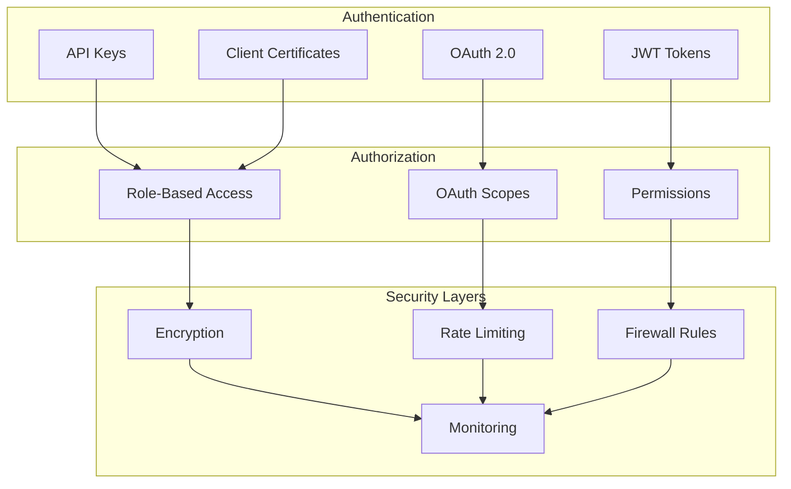
```mermaid
graph TD
    subgraph "Authentication"
        KEY[API Keys]
        OAU[OAuth 2.0]
        JWT[JWT Tokens]
        CERT[Client Certificates]
    end
    
    subgraph "Authorization"
        RBAC[Role-Based Access]
        SCOPE[OAuth Scopes]
        PERM[Permissions]
    end
    
    subgraph "Security Layers"
        ENC[Encryption]
        RATE[Rate Limiting]
        FIRE[Firewall Rules]
        MON[Monitoring]
    end
    
    KEY --> RBAC
    OAU --> SCOPE
    JWT --> PERM
    CERT --> RBAC
    
    RBAC --> ENC
    SCOPE --> RATE
    PERM --> FIRE
    
    ENC --> MON
    RATE --> MON
    FIRE --> MON
```

### 2. Secret Management

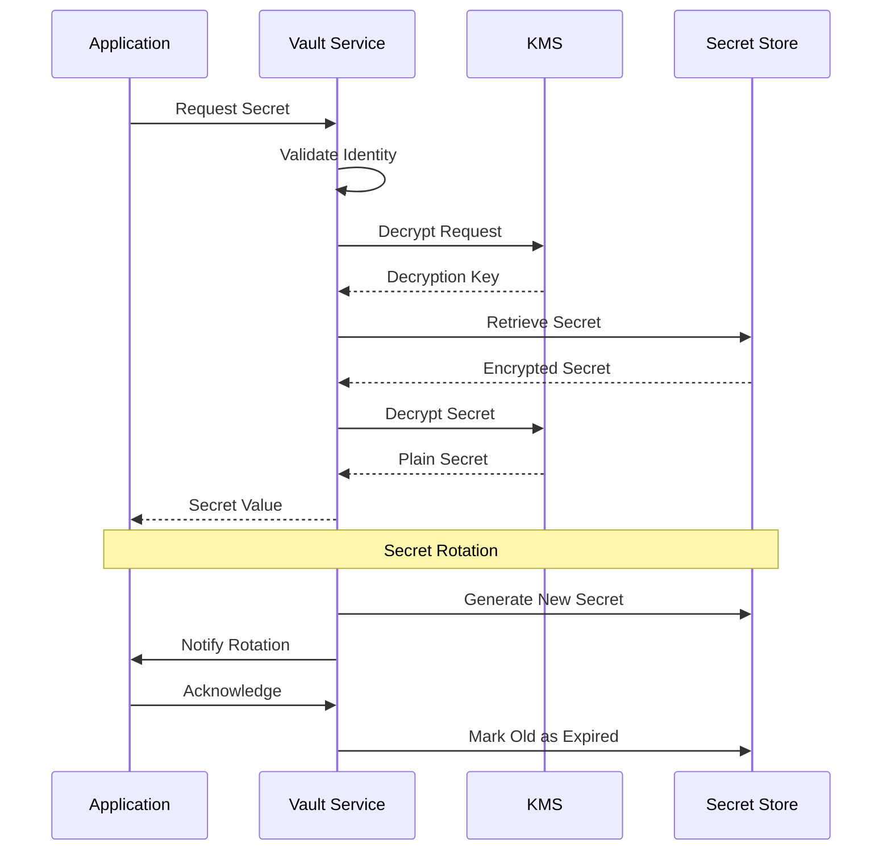
```mermaid
sequenceDiagram
    participant A as Application
    participant V as Vault Service
    participant K as KMS
    participant S as Secret Store
    
    A->>V: Request Secret
    V->>V: Validate Identity
    V->>K: Decrypt Request
    K-->>V: Decryption Key
    V->>S: Retrieve Secret
    S-->>V: Encrypted Secret
    V->>K: Decrypt Secret
    K-->>V: Plain Secret
    V-->>A: Secret Value
    
    Note over A,S: Secret Rotation
    V->>S: Generate New Secret
    V->>A: Notify Rotation
    A->>V: Acknowledge
    V->>S: Mark Old as Expired
```

## Integration Monitoring

### 1. Health Monitoring

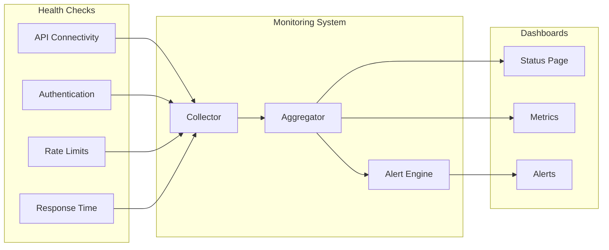
```mermaid
graph LR
    subgraph "Health Checks"
        HC1[API Connectivity]
        HC2[Authentication]
        HC3[Rate Limits]
        HC4[Response Time]
    end
    
    subgraph "Monitoring System"
        COL[Collector]
        AGG[Aggregator]
        ALT[Alert Engine]
    end
    
    subgraph "Dashboards"
        ST[Status Page]
        MT[Metrics]
        AL[Alerts]
    end
    
    HC1 --> COL
    HC2 --> COL
    HC3 --> COL
    HC4 --> COL
    
    COL --> AGG
    AGG --> ALT
    
    AGG --> ST
    AGG --> MT
    ALT --> AL
```

### 2. Performance Metrics

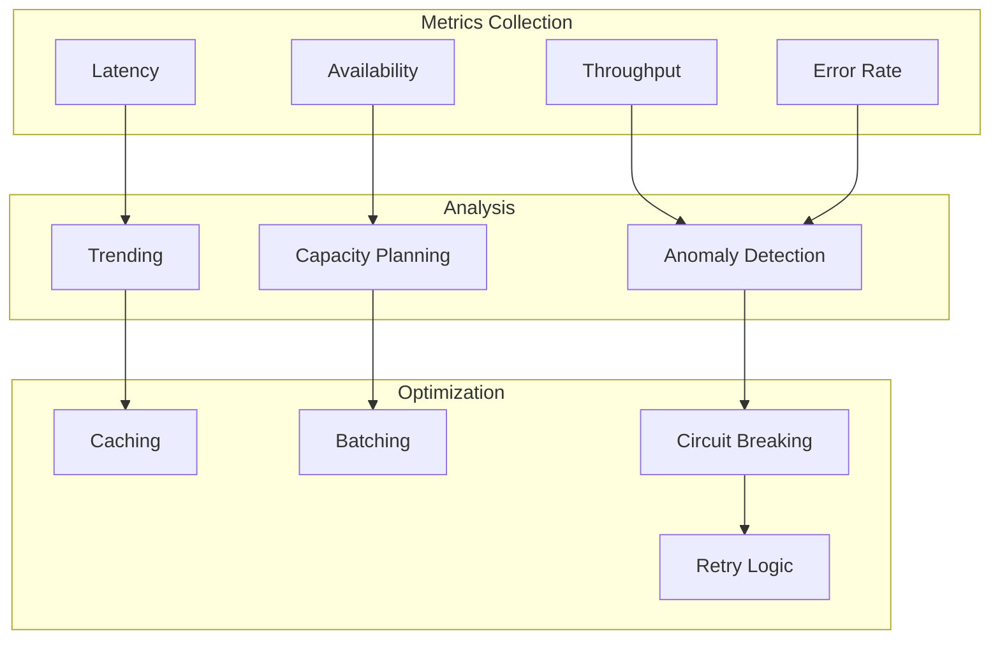
```mermaid
flowchart TD
    subgraph "Metrics Collection"
        LAT[Latency]
        THR[Throughput]
        ERR[Error Rate]
        AVL[Availability]
    end
    
    subgraph "Analysis"
        TRD[Trending]
        ANO[Anomaly Detection]
        CAP[Capacity Planning]
    end
    
    subgraph "Optimization"
        CAC[Caching]
        BAT[Batching]
        CIR[Circuit Breaking]
        RTY[Retry Logic]
    end
    
    LAT --> TRD
    THR --> ANO
    ERR --> ANO
    AVL --> CAP
    
    TRD --> CAC
    ANO --> CIR
    CAP --> BAT
    CIR --> RTY
```

## Integration Best Practices

### 1. Resilience Patterns

- **Circuit Breakers**: Prevent cascading failures
- **Retry Logic**: Exponential backoff with jitter
- **Fallback Mechanisms**: Graceful degradation
- **Timeouts**: Appropriate timeout configuration
- **Bulkheads**: Isolate critical resources

### 2. Data Consistency

- **Eventual Consistency**: For distributed systems
- **Idempotency**: Safe retry operations
- **Compensation Transactions**: Rollback mechanisms
- **Event Sourcing**: Audit trail and recovery
- **Conflict Resolution**: Last-write-wins or merge strategies

### 3. Performance Optimization

- **Connection Pooling**: Reuse connections
- **Batch Operations**: Reduce API calls
- **Caching**: Strategic caching layers
- **Compression**: Reduce payload sizes
- **Async Processing**: Non-blocking operations

## Summary

The SolarVoice AI integration architecture provides:

1. **Comprehensive Coverage**: Integrations with all major services needed for solar construction
2. **Reliability**: Multiple fallback mechanisms and error handling
3. **Security**: Industry-standard authentication and encryption
4. **Performance**: Optimized for low latency and high throughput
5. **Scalability**: Designed to handle enterprise-scale operations
6. **Flexibility**: Easy to add new integrations
7. **Monitoring**: Complete visibility into integration health

This architecture enables SolarVoice AI to seamlessly connect with the ecosystem of tools and services used in modern solar construction projects.