# SolarVoice AI Platform - System Architecture Documentation

## Executive Summary

SolarVoice AI is a voice-first, AI-powered platform for commercial and utility-scale solar construction management. The platform integrates cutting-edge voice AI technology with intelligent agent orchestration to revolutionize how solar construction projects are managed, from 150kW commercial installations to 500+ MW utility-scale farms.

## Table of Contents
1. [System Overview](#system-overview)
2. [High-Level Architecture](#high-level-architecture)
3. [Core Components](#core-components)
4. [Data Flow Architecture](#data-flow-architecture)
5. [Microservice Communication](#microservice-communication)
6. [Integration Points](#integration-points)
7. [Security Architecture](#security-architecture)
8. [Deployment Architecture](#deployment-architecture)

## System Overview

The SolarVoice AI platform consists of several interconnected systems:

- **Voice Processing Layer**: Real-time voice command processing with emotion detection
- **AI Agent Orchestration**: CrewAI-powered intelligent agents for specialized tasks
- **WebSocket Mesh Network**: Ultra-low latency real-time communication
- **API Gateway**: RESTful API for client applications
- **Integration Services**: External service integrations (ElevenLabs, Retell AI)

## High-Level Architecture

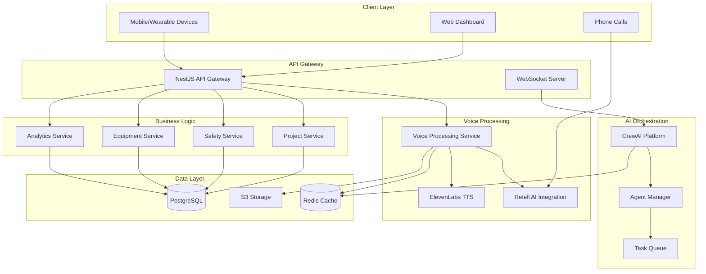

## Core Components

### 1. Voice Processing System

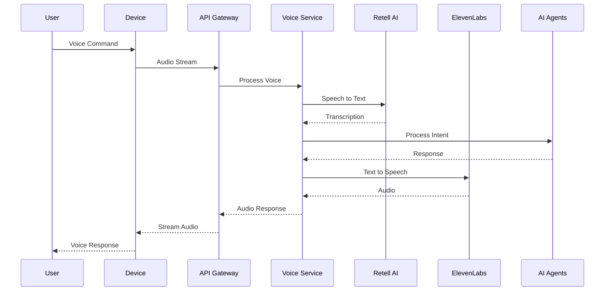

### 2. CrewAI Agent Architecture

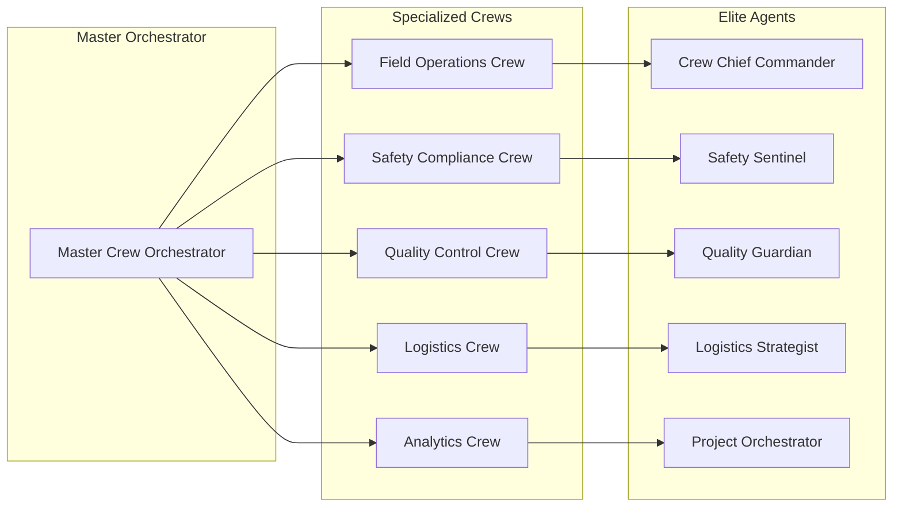

### 3. WebSocket Mesh Network

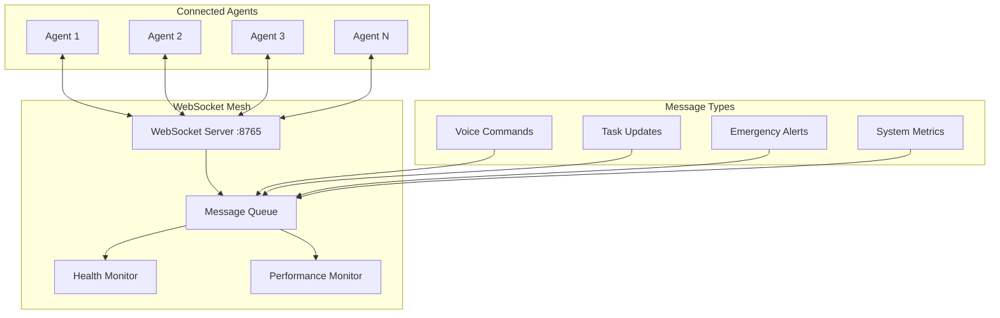

## Data Flow Architecture

### Voice Command Processing Flow

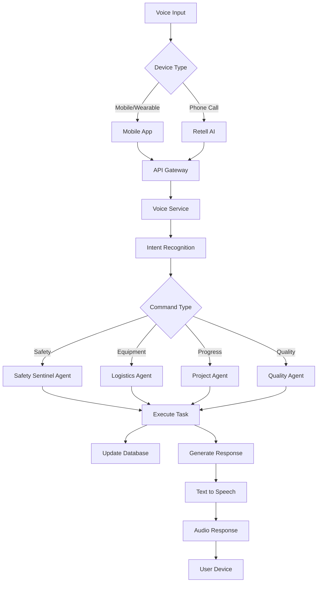

### Real-time Data Synchronization

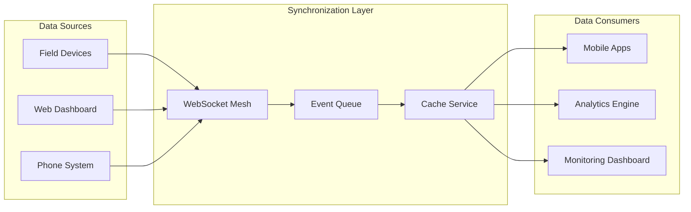

## Microservice Communication

### Service Interaction Patterns

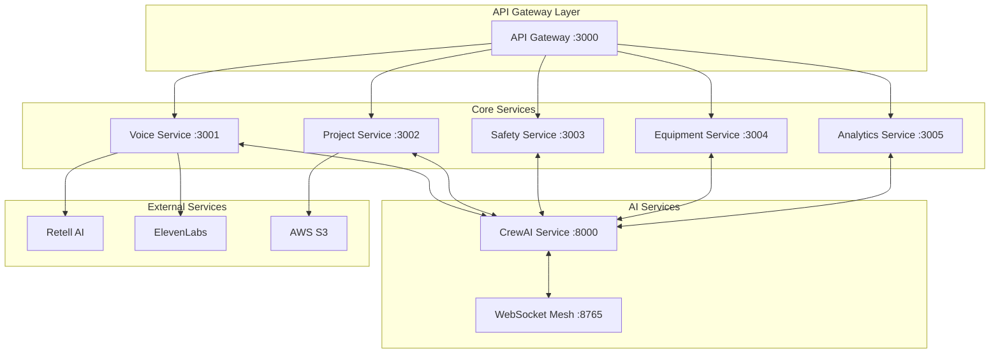

### Event-Driven Architecture

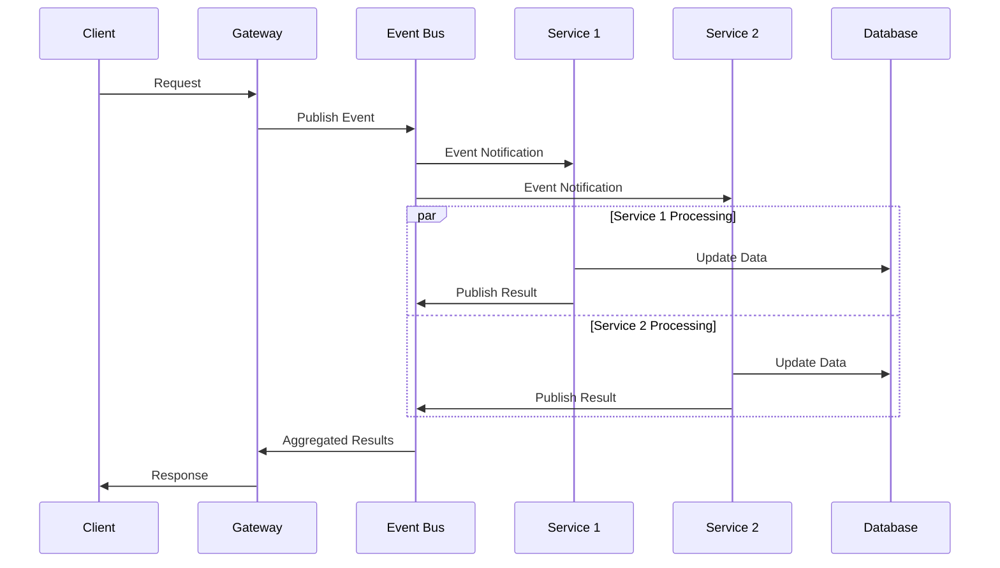

## Integration Points

### External Service Integrations

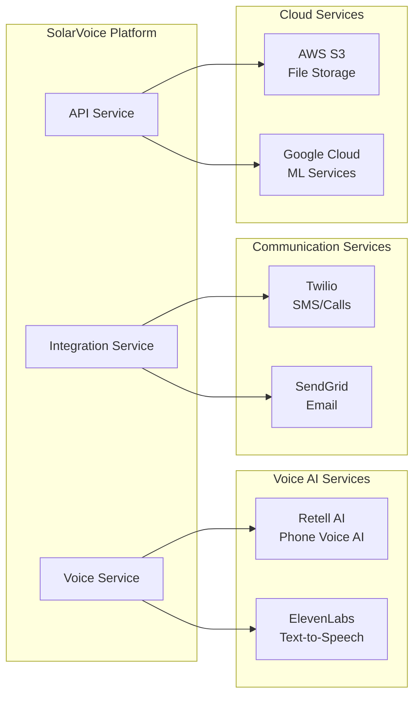

### API Integration Flow

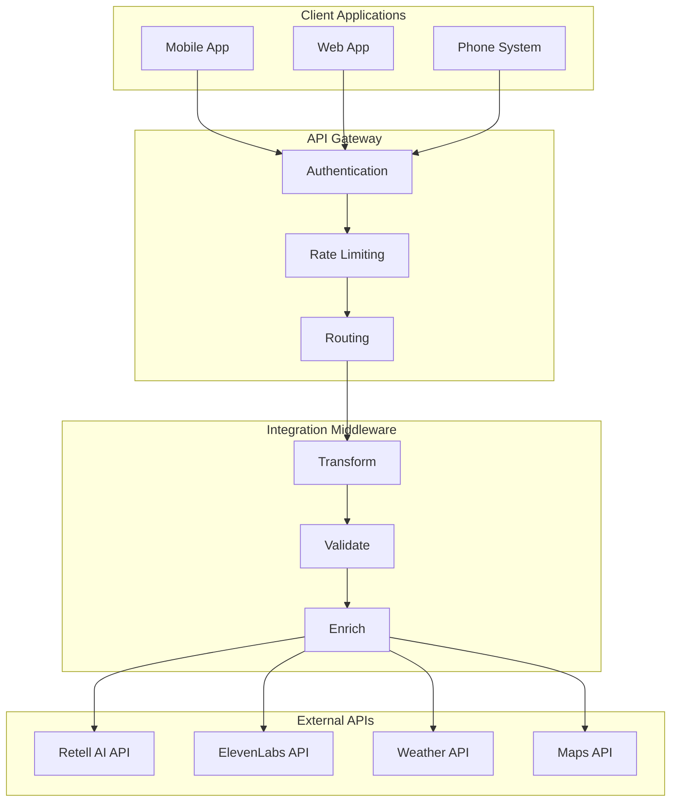

## Security Architecture

### Authentication & Authorization Flow

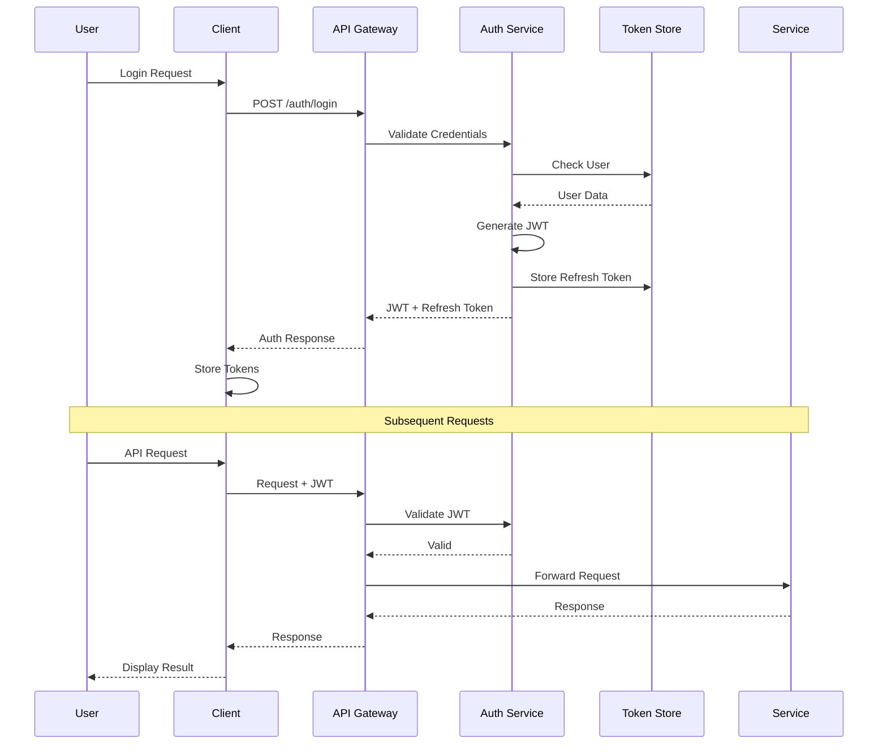

### Security Layers

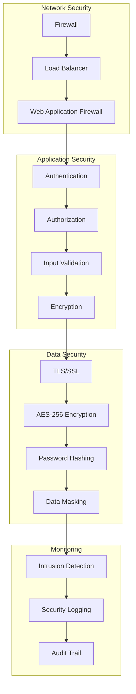

## Deployment Architecture

### Production Deployment

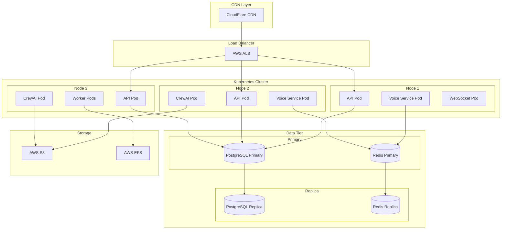

### Container Architecture

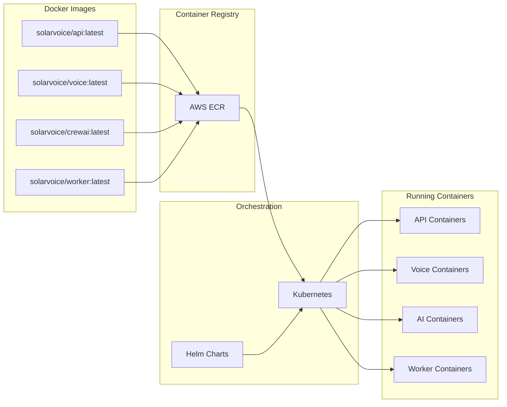

## Performance Architecture

### Caching Strategy

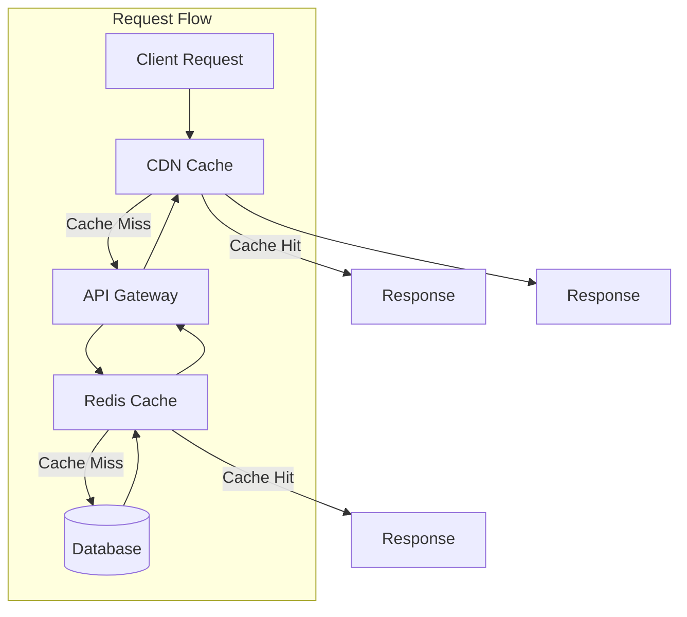

### Scalability Architecture

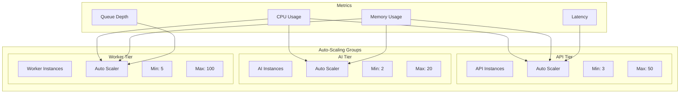

## Monitoring & Observability

### Monitoring Architecture

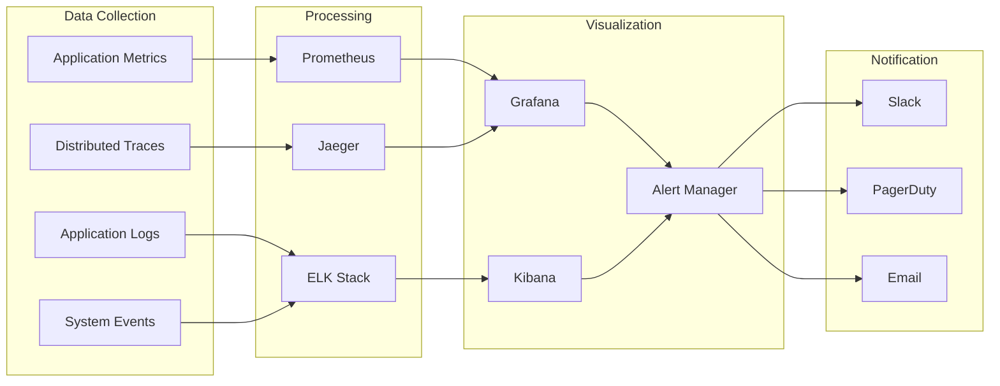

## Disaster Recovery

### Backup & Recovery Architecture

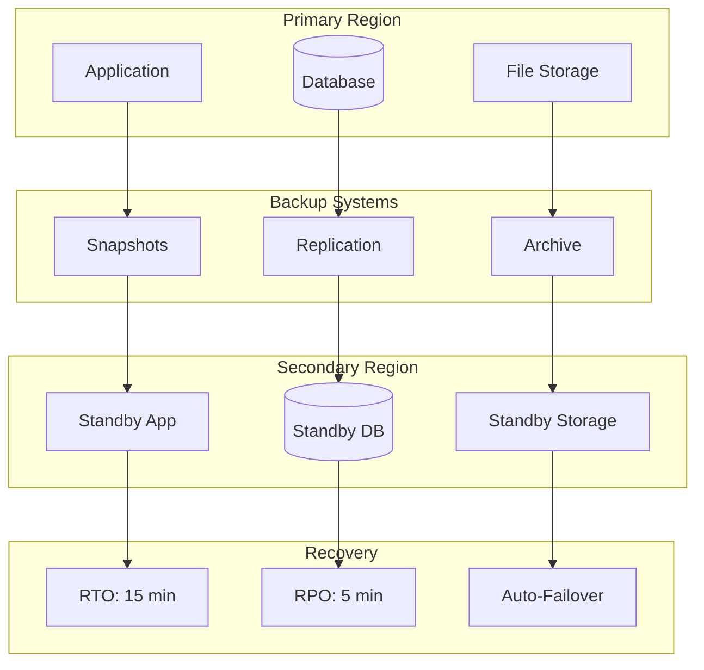

## Summary

The SolarVoice AI platform architecture is designed for:

1. **Scalability**: Supports 10,000+ concurrent connections and 500+ parallel tasks
2. **Reliability**: 99.99% uptime with auto-failover and redundancy
3. **Performance**: Sub-10ms API response times, <1ms WebSocket latency
4. **Security**: Military-grade encryption, zero-trust architecture
5. **Flexibility**: Microservice architecture allows independent scaling
6. **Intelligence**: AI-powered agents handle complex construction scenarios
7. **Integration**: Seamless integration with voice AI and external services
8. **Observability**: Comprehensive monitoring and alerting

The architecture supports the platform's mission to revolutionize solar construction management through voice-first, AI-powered solutions that work in the harsh realities of construction sites while maintaining enterprise-grade reliability and security.