# Voice Data Flow Architecture - SolarVoice AI Platform

## Overview

This document provides a detailed analysis of how voice commands flow through the SolarVoice AI platform, from initial audio capture to final voice response delivery. The platform supports multiple input channels and employs sophisticated AI processing to deliver context-aware responses.

## Voice Input Channels

The platform supports three primary voice input channels:

1. **Mobile/Wearable Devices**: Direct voice capture through mobile apps
2. **Web Dashboard**: Browser-based voice input
3. **Phone System**: Traditional phone calls via Retell AI integration

## Complete Voice Processing Flow

### 1. Voice Capture and Initial Processing

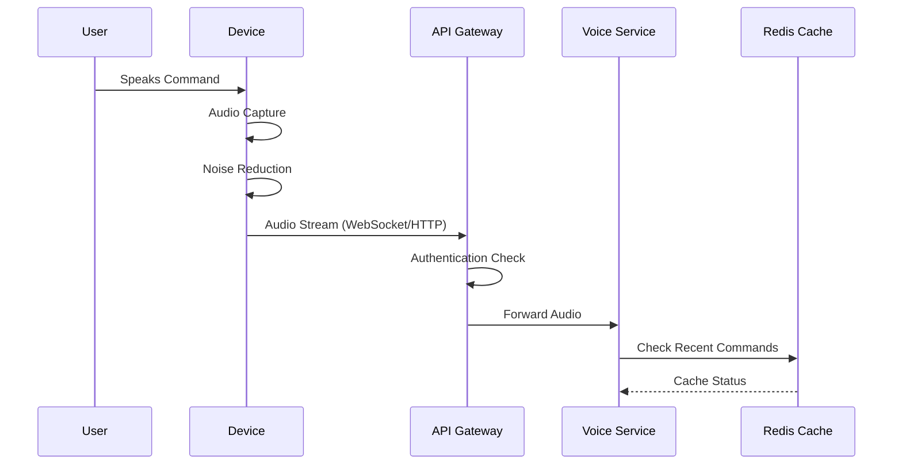

### 2. Speech Recognition and Intent Processing

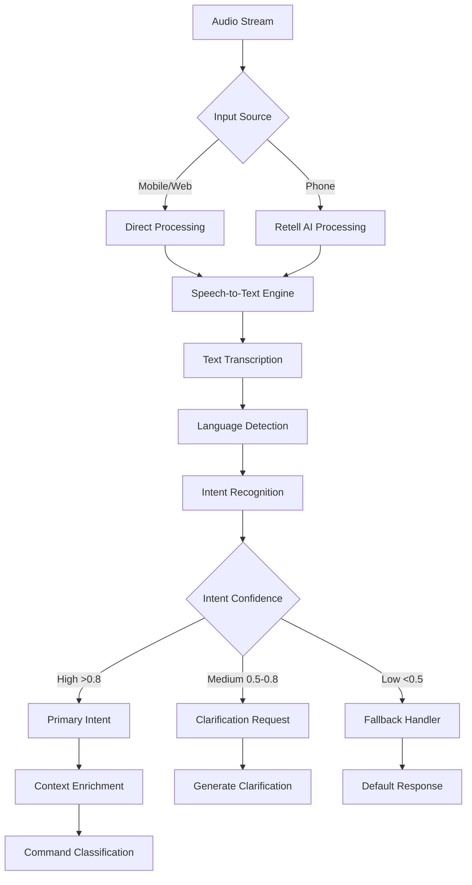

### 3. Command Classification and Routing

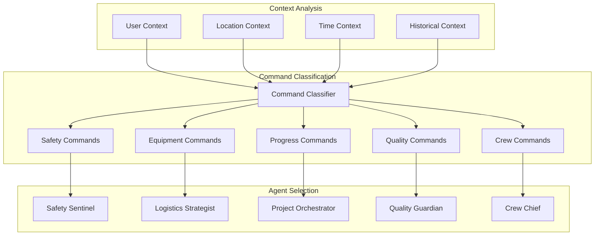

### 4. AI Agent Processing

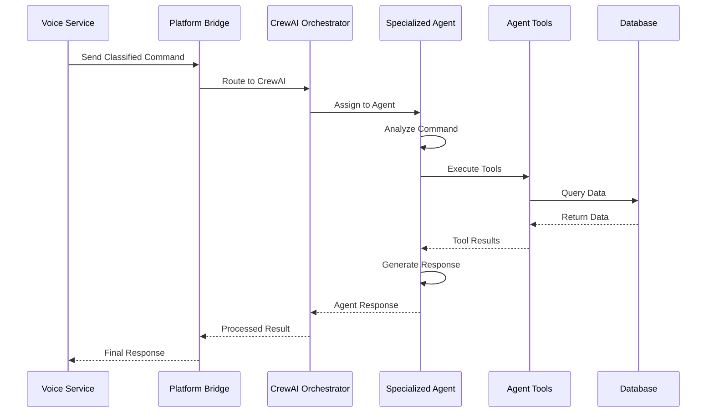

### 5. Response Generation and Emotion Mapping

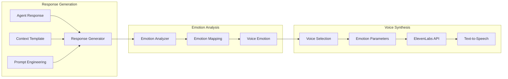

### 6. Audio Delivery and Feedback

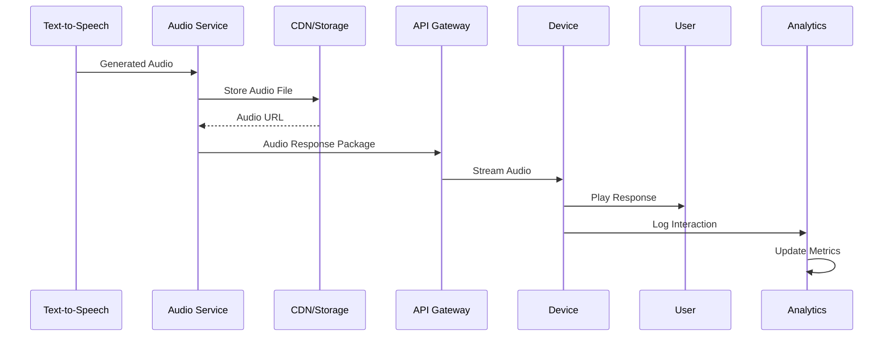

## Detailed Data Flow Examples

### Example 1: Safety Incident Report

```mermaid
flowchart TD
    A[User: "Emergency! Worker fell from scaffold in Zone A"] --> B[Voice Capture]
    
    B --> C[Speech Recognition]
    C --> D["Text: Emergency worker fell from scaffold in Zone A"]
    
    D --> E[Intent: SAFETY_EMERGENCY]
    E --> F[Priority: CRITICAL]
    
    F --> G[Route to Safety Sentinel]
    G --> H[Agent Actions]
    
    H --> I[Dispatch Emergency Services]
    H --> J[Alert Site Supervisor]
    H --> K[Log Incident]
    H --> L[Broadcast Alert]
    
    I --> M[Generate Response]
    J --> M
    K --> M
    L --> M
    
    M --> N["Response: Emergency services dispatched to Zone A. 
    ETA 8 minutes. All work in Zone A must stop immediately. 
    Site supervisor has been notified."]
    
    N --> O[Emotion: Urgent + Authoritative]
    O --> P[Voice: Emergency Response Voice]
    P --> Q[Audio Generation]
    Q --> R[Deliver to User]
```

### Example 2: Equipment Request

```mermaid
sequenceDiagram
    participant U as User
    participant S as System
    participant LA as Logistics Agent
    participant DB as Database
    participant EQ as Equipment Service
    
    U->>S: "I need a 250-ton crane at Site B tomorrow morning"
    S->>S: Recognize: Equipment Request
    S->>LA: Process Equipment Request
    
    LA->>DB: Check Crane Availability
    DB-->>LA: 3 cranes available
    
    LA->>DB: Check Site B Schedule
    DB-->>LA: Site accessible 7 AM
    
    LA->>EQ: Reserve Crane #2
    EQ-->>LA: Reservation Confirmed
    
    LA->>S: Generate Confirmation
    S->>S: Add Professional Tone
    S->>U: "250-ton crane reserved for Site B tomorrow. 
             Crane #2 will arrive at 7 AM. 
             Operator Johnson assigned. 
             Estimated cost: $3,500 for the day."
```

### Example 3: Multi-Agent Coordination

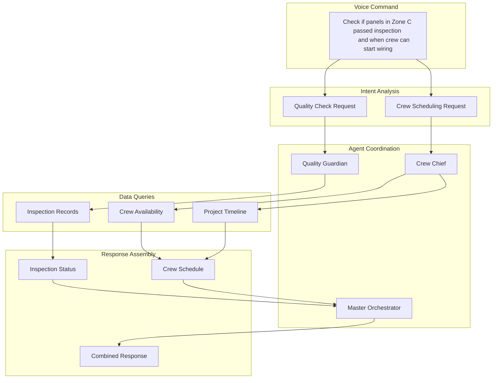

## Performance Optimizations

### 1. Caching Strategy

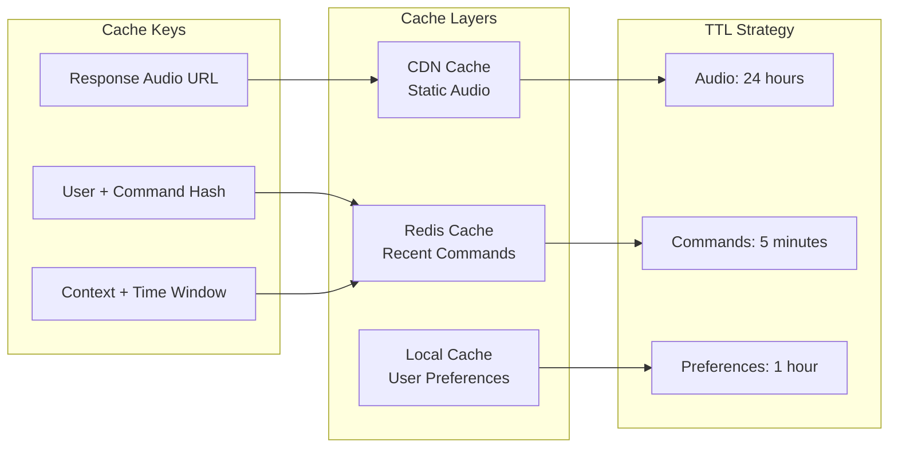

### 2. Parallel Processing

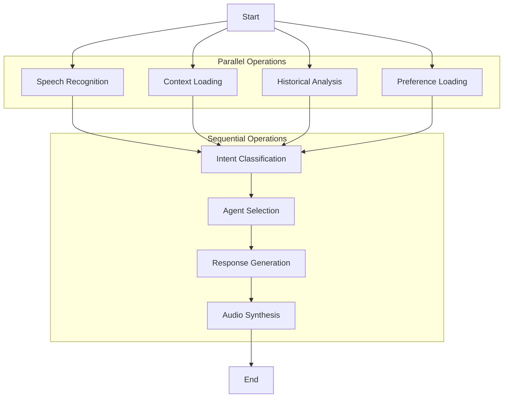

## Error Handling Flow

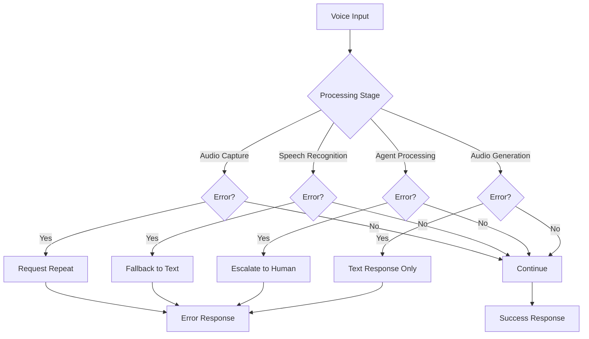

## Metrics and Monitoring

### Key Performance Indicators

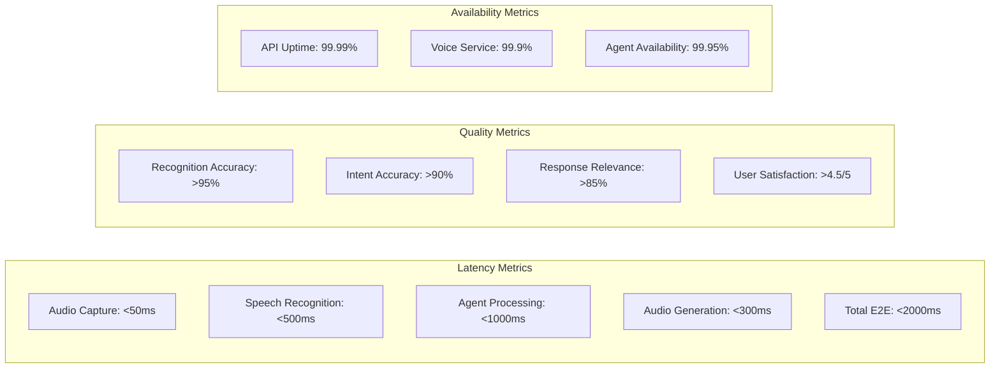

## Data Privacy and Security

### Voice Data Security Flow

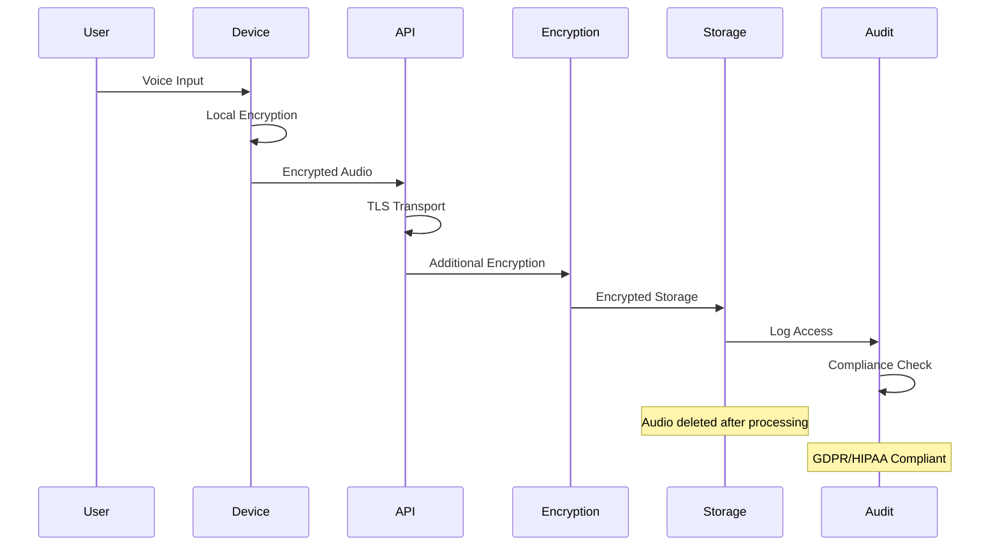

## Summary

The voice data flow architecture in SolarVoice AI is designed to provide:

1. **Ultra-Low Latency**: End-to-end processing in under 2 seconds
2. **High Accuracy**: 95%+ speech recognition, 90%+ intent classification
3. **Contextual Awareness**: Multi-dimensional context analysis
4. **Emotional Intelligence**: Dynamic voice emotion based on context
5. **Scalability**: Handles 10,000+ concurrent voice sessions
6. **Reliability**: Multiple fallback mechanisms ensure response delivery
7. **Security**: End-to-end encryption for voice data

This architecture enables construction workers to interact naturally with the system using voice commands, receiving intelligent, context-aware responses that help them work more safely and efficiently on solar construction projects.