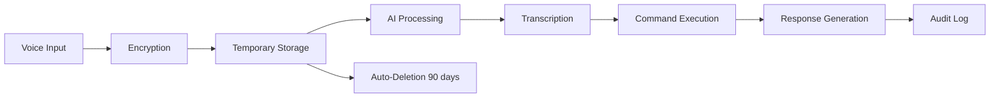
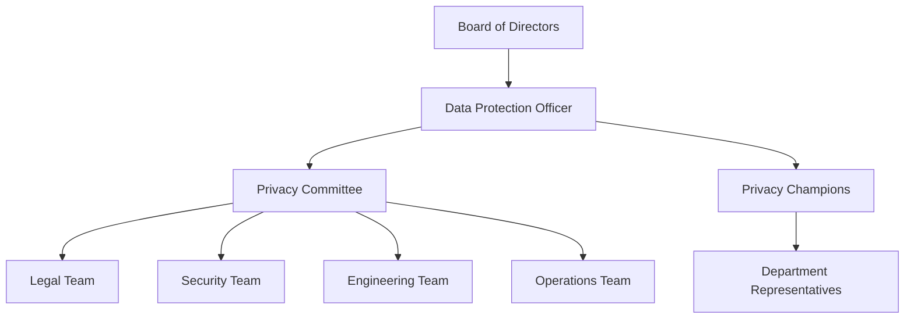

# Data Privacy Policy & Compliance Guide

## Table of Contents

1. [Privacy Overview](#privacy-overview)
2. [Data Protection Principles](#data-protection-principles)
3. [GDPR Compliance](#gdpr-compliance)
4. [CCPA Compliance](#ccpa-compliance)
5. [Data Collection & Processing](#data-collection--processing)
6. [User Rights](#user-rights)
7. [Data Security Measures](#data-security-measures)
8. [Third-Party Data Sharing](#third-party-data-sharing)
9. [International Data Transfers](#international-data-transfers)
10. [Privacy by Design](#privacy-by-design)
11. [Cookie Policy](#cookie-policy)
12. [Data Breach Procedures](#data-breach-procedures)
13. [Privacy Governance](#privacy-governance)
14. [Contact Information](#contact-information)

## Privacy Overview

SolarVoice AI Platform is committed to protecting the privacy and security of personal data. This comprehensive guide outlines our data privacy practices, compliance measures, and technical implementations to ensure GDPR, CCPA, and other privacy regulation compliance.

### Core Privacy Commitments

- **Transparency**: Clear communication about data practices
- **Control**: User control over personal data
- **Security**: Enterprise-grade data protection
- **Minimization**: Collect only necessary data
- **Purpose Limitation**: Use data only for stated purposes
- **Accountability**: Documented compliance processes

## Data Protection Principles

### 1. Lawfulness, Fairness, and Transparency

We process personal data lawfully, fairly, and transparently:

```typescript
// Example: Consent tracking implementation
interface ConsentRecord {
  userId: string;
  purposes: ConsentPurpose[];
  timestamp: Date;
  ipAddress: string;
  version: string;
}

interface ConsentPurpose {
  purpose: 'marketing' | 'analytics' | 'essential' | 'voice_processing';
  granted: boolean;
  timestamp: Date;
  withdrawable: boolean;
}
```

### 2. Purpose Limitation

Data is collected for specified, explicit, and legitimate purposes:

| Data Category | Purpose | Legal Basis | Retention |
|---------------|---------|-------------|-----------|
| Account Information | Service provision | Contract | Account lifetime + 30 days |
| Voice Recordings | Command processing | Consent | 90 days |
| Project Data | Service delivery | Contract | Project lifetime + 1 year |
| Analytics Data | Service improvement | Legitimate interest | 2 years |
| Marketing Data | Communications | Consent | Until withdrawn |

### 3. Data Minimization

We collect only data necessary for specified purposes:

```javascript
// Data collection configuration
const DATA_COLLECTION_CONFIG = {
  account: {
    required: ['email', 'company_name'],
    optional: ['phone', 'timezone', 'language'],
    prohibited: ['ssn', 'financial_details']
  },
  voice: {
    required: ['audio_sample'],
    optional: ['transcript', 'metadata'],
    anonymized: ['voice_print']
  },
  telemetry: {
    collected: ['usage_stats', 'performance_metrics'],
    excluded: ['personal_identifiers', 'location_precise']
  }
};
```

### 4. Accuracy

We maintain accurate and up-to-date personal data:

- Self-service data update portal
- Regular data verification prompts
- Automated data quality checks
- Clear update procedures

### 5. Storage Limitation

Data retention policies by category:

```yaml
retention_policies:
  active_user_data:
    duration: "account_active"
    review: "annual"
  
  inactive_user_data:
    duration: "30_days"
    action: "anonymize_or_delete"
  
  voice_recordings:
    duration: "90_days"
    action: "automatic_deletion"
    exceptions: "user_flagged_important"
  
  audit_logs:
    duration: "2_years"
    action: "archive_then_delete"
    compliance: "regulatory_requirement"
  
  backup_data:
    duration: "30_days"
    action: "rotation"
    encryption: "AES-256"
```

### 6. Integrity and Confidentiality

Technical and organizational measures for data protection:

- End-to-end encryption for voice data
- AES-256 encryption at rest
- TLS 1.3 for data in transit
- Access controls and monitoring
- Regular security assessments

## GDPR Compliance

### Scope and Application

SolarVoice AI complies with GDPR for all EU/EEA users:

- **Data Controller**: SolarVoice AI, Inc.
- **Data Protection Officer**: privacy@solarvoice.ai
- **EU Representative**: [To be appointed]

### Legal Bases for Processing

We process personal data under the following legal bases:

1. **Consent** (Article 6(1)(a))
   - Voice recording processing
   - Marketing communications
   - Optional features

2. **Contract** (Article 6(1)(b))
   - Account creation
   - Service provision
   - Billing and payments

3. **Legal Obligation** (Article 6(1)(c))
   - Tax records
   - Regulatory compliance
   - Legal requests

4. **Legitimate Interests** (Article 6(1)(f))
   - Security monitoring
   - Service improvements
   - Fraud prevention

### Data Subject Rights Implementation

#### 1. Right to Access (Article 15)

```typescript
// API endpoint for data access requests
@Controller('privacy')
export class PrivacyController {
  @Post('/data-access-request')
  @UseGuards(AuthGuard)
  async requestDataAccess(@CurrentUser() user: User) {
    const requestId = await this.privacyService.createAccessRequest(user.id);
    
    // Generate comprehensive data report
    const userData = await this.privacyService.collectUserData(user.id, {
      includeCategories: [
        'profile',
        'projects',
        'voice_recordings',
        'activity_logs',
        'preferences',
        'consents'
      ],
      format: 'structured_json',
      includeMetadata: true
    });
    
    return {
      requestId,
      estimatedDelivery: '48_hours',
      deliveryMethod: 'secure_download'
    };
  }
}
```

#### 2. Right to Rectification (Article 16)

Self-service data correction interface:

```typescript
// Data update validation
const updateValidation = {
  email: Joi.string().email().required(),
  phone: Joi.string().pattern(/^\+?[1-9]\d{1,14}$/),
  company: Joi.string().max(255),
  // Audit trail for all changes
  auditLog: true,
  notifyUser: true
};
```

#### 3. Right to Erasure (Article 17)

Data deletion implementation:

```typescript
interface DeletionRequest {
  userId: string;
  reason: 'user_request' | 'retention_expired' | 'consent_withdrawn';
  scope: 'all' | Partial<DataCategory[]>;
  timestamp: Date;
  verificationMethod: 'email' | 'mfa';
}

class DataDeletionService {
  async processErasureRequest(request: DeletionRequest) {
    // Verify legal grounds for retention
    const retentionRequired = await this.checkLegalRetention(request.userId);
    
    if (!retentionRequired) {
      // Immediate deletion
      await this.deleteUserData(request);
      await this.notifyThirdParties(request);
      await this.confirmDeletion(request);
    } else {
      // Restricted processing
      await this.restrictProcessing(request);
      await this.scheduleDelayedDeletion(request);
    }
  }
}
```

#### 4. Right to Data Portability (Article 20)

Export functionality:

```typescript
// Data export formats
enum ExportFormat {
  JSON = 'json',
  CSV = 'csv',
  XML = 'xml'
}

interface DataExport {
  async exportUserData(userId: string, format: ExportFormat) {
    const data = await this.collectPortableData(userId);
    
    return {
      format,
      data: this.formatData(data, format),
      metadata: {
        exportDate: new Date(),
        dataCategories: Object.keys(data),
        format: format,
        schema: this.getDataSchema()
      }
    };
  }
}
```

#### 5. Right to Restrict Processing (Article 18)

Processing restriction controls:

```javascript
const restrictionOptions = {
  marketing: {
    emails: false,
    analytics: false,
    profiling: false
  },
  voice: {
    training: false,
    improvement: false,
    sharing: false
  },
  essential: {
    // Cannot be restricted
    authentication: true,
    security: true,
    legal: true
  }
};
```

#### 6. Right to Object (Article 21)

Opt-out mechanisms:

```yaml
objection_handling:
  direct_marketing:
    method: "immediate_cessation"
    confirmation: "email"
    
  profiling:
    review: "manual"
    response_time: "72_hours"
    
  legitimate_interest:
    assessment: "balancing_test"
    documentation: "required"
```

### Privacy Impact Assessments (DPIA)

We conduct DPIAs for high-risk processing:

```markdown
## DPIA Template

### 1. Processing Description
- Nature of processing
- Scope and context
- Purposes and legal basis
- Data categories

### 2. Necessity and Proportionality
- Why processing is necessary
- Benefits vs. risks
- Alternative approaches
- Safeguards implemented

### 3. Risk Assessment
- Rights and freedoms impacts
- Likelihood and severity
- Mitigation measures
- Residual risks

### 4. Consultation
- Stakeholder views
- DPO advice
- Technical measures
- Approval process
```

## CCPA Compliance

### California Consumer Privacy Rights

#### 1. Right to Know

Information disclosure requirements:

```typescript
interface CCPADisclosure {
  personalInfoCategories: string[];
  sources: string[];
  businessPurposes: string[];
  thirdPartyCategories: string[];
  salesInfo: {
    sold: boolean;
    categories: string[];
    optOutLink: string;
  };
}

// Consumer request handling
@Post('/ccpa/consumer-request')
async handleConsumerRequest(
  @Body() request: ConsumerRequest,
  @Headers('X-Verification-Token') token: string
) {
  // Verify consumer identity
  await this.verifyConsumer(request.email, token);
  
  // Process request within 45 days
  const response = await this.processRequest(request);
  
  return {
    requestId: response.id,
    expectedDelivery: '45 days',
    verificationRequired: true
  };
}
```

#### 2. Right to Delete

Deletion request processing:

```javascript
const ccpaDeletion = {
  verificationSteps: [
    'email_confirmation',
    'identity_verification',
    'account_ownership'
  ],
  
  exceptions: [
    'complete_transaction',
    'security_incident',
    'legal_compliance',
    'internal_uses'
  ],
  
  timeline: {
    acknowledgment: '10 days',
    completion: '45 days',
    extension: '90 days max'
  }
};
```

#### 3. Right to Opt-Out

Sale of personal information:

```typescript
// We do not sell personal information
const dataSalePolicy = {
  sellsPersonalInfo: false,
  sharesForValue: false,
  optOutMechanism: 'not_applicable',
  
  // Third-party sharing for service provision
  serviceProviders: [
    {
      name: 'AWS',
      purpose: 'infrastructure',
      dataShared: ['encrypted_data'],
      contract: 'DPA'
    },
    {
      name: 'Retell AI',
      purpose: 'voice_processing',
      dataShared: ['voice_samples'],
      contract: 'DPA'
    }
  ]
};
```

#### 4. Right to Non-Discrimination

Equal service provision:

```yaml
non_discrimination_policy:
  price_differences: "prohibited"
  service_quality: "equal_for_all"
  incentives: "transparent_and_fair"
  requirements: "no_waiver_required"
```

### CCPA Metrics Reporting

Annual privacy metrics:

```javascript
const privacyMetrics = {
  year: 2024,
  requests: {
    access: { received: 142, completed: 140, avgDays: 12 },
    deletion: { received: 67, completed: 65, avgDays: 18 },
    optOut: { received: 0, completed: 0, avgDays: 0 }
  },
  
  dataBreaches: 0,
  
  compliance: {
    training: '100% staff trained',
    audits: 'Quarterly',
    incidents: 0
  }
};
```

## Data Collection & Processing

### Types of Data Collected

#### 1. Account Data
```typescript
interface AccountData {
  // Directly provided
  email: string;
  companyName: string;
  contactName: string;
  phoneNumber?: string;
  
  // System generated
  userId: UUID;
  createdAt: Date;
  lastActive: Date;
  
  // Preferences
  timezone: string;
  language: string;
  notifications: NotificationPreferences;
}
```

#### 2. Voice Data
```typescript
interface VoiceData {
  // Audio processing
  recordings: {
    id: string;
    timestamp: Date;
    duration: number;
    encrypted: true;
    purpose: 'command' | 'training' | 'support';
  }[];
  
  // Derived data
  transcripts: {
    text: string;
    confidence: number;
    language: string;
    anonymized: boolean;
  }[];
  
  // Biometric data (opt-in)
  voicePrint?: {
    encrypted: true;
    purpose: 'authentication';
    consent: ConsentRecord;
  };
}
```

#### 3. Project Data
```typescript
interface ProjectData {
  // Business data
  projects: Project[];
  crews: CrewAssignment[];
  equipment: Equipment[];
  schedules: Schedule[];
  
  // Metadata
  created: Timestamp;
  modified: Timestamp;
  accessLog: AccessRecord[];
}
```

#### 4. Usage Analytics
```typescript
interface AnalyticsData {
  // Aggregated metrics
  featureUsage: Map<string, number>;
  sessionDuration: number;
  apiCalls: number;
  
  // Performance data
  responseTime: number[];
  errorRate: number;
  
  // No personal identifiers
  anonymousId: string;
  cohort: string;
}
```

### Data Processing Activities

#### Voice Processing Pipeline



#### Security Measures in Processing

```javascript
const processingSecurityMeasures = {
  encryption: {
    algorithm: 'AES-256-GCM',
    keyRotation: '30 days',
    keyStorage: 'HSM'
  },
  
  access: {
    authentication: 'multi-factor',
    authorization: 'role-based',
    logging: 'comprehensive'
  },
  
  isolation: {
    network: 'segmented',
    compute: 'sandboxed',
    storage: 'encrypted'
  },
  
  monitoring: {
    realTime: true,
    anomalyDetection: true,
    alerting: '24/7'
  }
};
```

## User Rights

### Universal Rights Management

#### Rights Request Portal

```typescript
@Controller('user-rights')
export class UserRightsController {
  @Post('/submit-request')
  @UseGuards(AuthGuard)
  async submitRightsRequest(
    @CurrentUser() user: User,
    @Body() request: RightsRequest
  ) {
    // Validate request type
    const validTypes = [
      'access',
      'rectification',
      'erasure',
      'portability',
      'restriction',
      'objection'
    ];
    
    if (!validTypes.includes(request.type)) {
      throw new BadRequestException('Invalid request type');
    }
    
    // Create tracked request
    const trackedRequest = await this.rightsService.createRequest({
      userId: user.id,
      type: request.type,
      details: request.details,
      priority: this.calculatePriority(request),
      deadline: this.calculateDeadline(request.type)
    });
    
    // Send confirmation
    await this.notificationService.sendConfirmation(
      user.email,
      trackedRequest
    );
    
    return {
      requestId: trackedRequest.id,
      status: 'received',
      expectedCompletion: trackedRequest.deadline,
      trackingUrl: `/privacy/track/${trackedRequest.id}`
    };
  }
}
```

### Automated Rights Fulfillment

```typescript
class AutomatedRightsFulfillment {
  async processAccessRequest(userId: string) {
    const data = await this.gatherAllUserData(userId);
    const report = await this.generatePrivacyReport(data);
    const secureUrl = await this.uploadSecurely(report);
    
    await this.notifyUser(userId, {
      type: 'access_request_complete',
      downloadUrl: secureUrl,
      expiresIn: '7 days'
    });
  }
  
  async processPortabilityRequest(userId: string, format: string) {
    const portableData = await this.extractPortableData(userId);
    const formatted = await this.formatData(portableData, format);
    const downloadUrl = await this.prepareDownload(formatted);
    
    return {
      url: downloadUrl,
      format: format,
      size: formatted.size,
      categories: Object.keys(portableData)
    };
  }
}
```

## Data Security Measures

### Technical Safeguards

#### Encryption Implementation

```typescript
class EncryptionService {
  private readonly algorithm = 'aes-256-gcm';
  private readonly keyDerivation = 'scrypt';
  
  async encryptPersonalData(data: any, category: DataCategory) {
    const key = await this.getDEK(category);
    const iv = crypto.randomBytes(16);
    const cipher = crypto.createCipheriv(this.algorithm, key, iv);
    
    const encrypted = Buffer.concat([
      cipher.update(JSON.stringify(data), 'utf8'),
      cipher.final()
    ]);
    
    const tag = cipher.getAuthTag();
    
    return {
      encrypted: encrypted.toString('base64'),
      iv: iv.toString('base64'),
      tag: tag.toString('base64'),
      algorithm: this.algorithm,
      keyId: key.id
    };
  }
}
```

#### Access Control Matrix

```yaml
access_control:
  roles:
    data_subject:
      own_data: [read, update, delete, export]
      others_data: []
      
    organization_admin:
      own_org_data: [read, update]
      user_data: [read_anonymized]
      
    system_admin:
      all_data: [read_anonymized]
      audit_logs: [read]
      
    data_processor:
      assigned_data: [read, process]
      retention: [enforce]
```

### Organizational Safeguards

#### Privacy Training Program

```markdown
## Annual Privacy Training Curriculum

### Module 1: Privacy Fundamentals
- Data protection principles
- Legal requirements
- Company policies

### Module 2: Data Handling
- Classification
- Secure processing
- Retention rules

### Module 3: Incident Response
- Breach identification
- Reporting procedures
- Mitigation steps

### Module 4: Rights Management
- User requests
- Response procedures
- Documentation
```

#### Privacy Governance Structure



## Third-Party Data Sharing

### Data Processor Agreements

All third-party processors must sign comprehensive DPAs:

```typescript
interface DataProcessorAgreement {
  processor: {
    name: string;
    contact: string;
    dpo: string;
  };
  
  processing: {
    purposes: string[];
    categories: DataCategory[];
    duration: string;
    location: string[];
  };
  
  security: {
    measures: SecurityMeasure[];
    certifications: string[];
    audits: AuditSchedule;
  };
  
  subprocessors: {
    allowed: boolean;
    notification: 'prior' | 'general';
    objectionPeriod: number;
  };
  
  obligations: {
    confidentiality: boolean;
    deletion: boolean;
    assistance: boolean;
    audit: boolean;
  };
}
```

### Third-Party Inventory

| Processor | Purpose | Data Shared | Location | Safeguards |
|-----------|---------|-------------|----------|------------|
| AWS | Infrastructure | All (encrypted) | US-East | SOC2, ISO27001 |
| Retell AI | Voice Processing | Voice samples | US | DPA, Encryption |
| ElevenLabs | Voice Synthesis | Text | US/EU | DPA, GDPR compliant |
| Stripe | Payments | Payment info | US/EU | PCI-DSS |
| SendGrid | Email | Email addresses | US | DPA, SOC2 |

### Data Sharing Controls

```javascript
const dataSharingPolicy = {
  approval: {
    newProcessor: 'DPO + Legal',
    dataCategories: 'Privacy Committee',
    international: 'Executive approval'
  },
  
  requirements: {
    contract: 'DPA required',
    security: 'Assessment required',
    privacy: 'Impact assessment',
    monitoring: 'Continuous'
  },
  
  restrictions: {
    sensitiveData: 'Additional safeguards',
    biometric: 'Explicit consent',
    minors: 'Prohibited'
  }
};
```

## International Data Transfers

### Transfer Mechanisms

#### Standard Contractual Clauses (SCCs)

```yaml
scc_implementation:
  module_used: "Controller to Processor"
  additional_safeguards:
    - encryption_in_transit
    - encryption_at_rest
    - access_controls
    - audit_rights
    
  risk_assessment:
    destination_countries: ["US", "Canada", "UK"]
    legal_framework: "Reviewed quarterly"
    surveillance_laws: "Assessed"
    remedies: "Documented"
```

#### Adequacy Decisions

Transfers to countries with adequacy decisions:
- European Economic Area (EEA)
- United Kingdom
- Canada (commercial organizations)
- Japan
- South Korea

### Transfer Impact Assessment (TIA)

```markdown
## TIA Template

### 1. Transfer Mapping
- Data categories
- Volume and frequency
- Recipients
- Countries

### 2. Legal Assessment
- Local laws analysis
- Government access rights
- Legal remedies
- Case law

### 3. Risk Evaluation
- Likelihood of access
- Impact on individuals
- Mitigation effectiveness

### 4. Supplementary Measures
- Technical measures
- Contractual measures
- Organizational measures
```

## Privacy by Design

### Design Principles Implementation

#### 1. Proactive not Reactive

```typescript
// Privacy requirements in development
interface FeatureDevelopment {
  privacyReview: {
    required: boolean;
    reviewer: 'DPO' | 'Privacy Team';
    stage: 'design' | 'implementation' | 'testing';
  };
  
  privacyRequirements: {
    dataMinimization: boolean;
    purposeLimitation: boolean;
    encryption: EncryptionRequirement;
    retention: RetentionPolicy;
  };
}
```

#### 2. Privacy as Default

```javascript
// Default privacy settings
const defaultPrivacySettings = {
  dataCollection: {
    essential: true,
    analytics: false,
    marketing: false,
    improvement: false
  },
  
  sharing: {
    internal: 'need-to-know',
    external: 'none',
    anonymized: 'opt-in'
  },
  
  retention: {
    active: 'service-duration',
    inactive: '30-days',
    deleted: 'immediate'
  }
};
```

#### 3. Full Functionality

Achieving both privacy and functionality:

```typescript
class PrivacyPreservingAnalytics {
  async collectMetrics(event: AnalyticsEvent) {
    // Remove personal identifiers
    const anonymized = this.anonymizeEvent(event);
    
    // Add noise for differential privacy
    const private = this.addNoise(anonymized);
    
    // Aggregate before storage
    const aggregated = this.aggregate(private);
    
    await this.store(aggregated);
  }
  
  private anonymizeEvent(event: AnalyticsEvent) {
    return {
      ...event,
      userId: this.hashUserId(event.userId),
      ip: this.generalizeIP(event.ip),
      timestamp: this.generalizeTime(event.timestamp)
    };
  }
}
```

### Privacy Engineering Practices

#### Threat Modeling

```yaml
privacy_threat_model:
  assets:
    - personal_data
    - voice_recordings
    - usage_patterns
    
  threats:
    - unauthorized_access
    - excessive_collection
    - purpose_creep
    - inadequate_deletion
    
  controls:
    - access_management
    - data_minimization
    - purpose_binding
    - automated_deletion
```

#### Privacy Patterns

```typescript
// Privacy Design Patterns

// 1. Informed Consent Pattern
class InformedConsent {
  async requestConsent(purpose: ConsentPurpose) {
    return {
      purpose: purpose.description,
      dataUsed: purpose.dataCategories,
      retention: purpose.retentionPeriod,
      sharing: purpose.thirdParties,
      rights: this.getUserRights(),
      withdraw: this.getWithdrawMethod()
    };
  }
}

// 2. Selective Disclosure Pattern
class SelectiveDisclosure {
  async shareData(request: DataRequest) {
    const minimalData = this.determineMinimalSet(request);
    const anonymized = this.anonymizeIfPossible(minimalData);
    return this.encrypt(anonymized);
  }
}

// 3. Anonymization Pattern
class AnonymizationService {
  async anonymizeDataset(data: any[]) {
    const kAnonymized = this.applyKAnonymity(data, k=5);
    const lDiverse = this.applyLDiversity(kAnonymized, l=3);
    return this.applyTCloseness(lDiverse, t=0.2);
  }
}
```

## Cookie Policy

### Cookie Categories

```javascript
const cookieCategories = {
  essential: {
    description: 'Required for basic site functionality',
    examples: ['session_id', 'csrf_token', 'auth_token'],
    expiry: 'session',
    optOut: false
  },
  
  functional: {
    description: 'Remember user preferences',
    examples: ['language', 'timezone', 'theme'],
    expiry: '1 year',
    optOut: true
  },
  
  analytics: {
    description: 'Understand site usage',
    examples: ['_ga', '_gid', 'amplitude_id'],
    expiry: '2 years',
    optOut: true
  },
  
  marketing: {
    description: 'Marketing and advertising',
    examples: [],
    expiry: 'N/A',
    optOut: true,
    default: false
  }
};
```

### Cookie Consent Implementation

```typescript
@Injectable()
export class CookieConsentService {
  async initializeConsent(request: Request) {
    const existingConsent = this.getExistingConsent(request);
    
    if (!existingConsent) {
      // Show consent banner
      return {
        showBanner: true,
        categories: this.getConsentCategories(),
        granularControl: true
      };
    }
    
    // Apply existing preferences
    this.applyConsentPreferences(existingConsent);
  }
  
  async updateConsent(preferences: ConsentPreferences) {
    // Store consent
    await this.storeConsent(preferences);
    
    // Update cookies
    this.updateCookies(preferences);
    
    // Notify third parties
    await this.notifyThirdParties(preferences);
    
    // Audit log
    await this.auditConsentChange(preferences);
  }
}
```

### Cookie List

| Cookie Name | Category | Purpose | Expiry | Provider |
|-------------|----------|---------|--------|----------|
| sv_session | Essential | Session management | Session | SolarVoice |
| sv_auth | Essential | Authentication | 24 hours | SolarVoice |
| sv_csrf | Essential | Security | Session | SolarVoice |
| sv_lang | Functional | Language preference | 1 year | SolarVoice |
| sv_theme | Functional | UI theme | 1 year | SolarVoice |
| sv_analytics | Analytics | Usage tracking | 2 years | SolarVoice |

## Data Breach Procedures

### Breach Response Plan

#### 1. Detection & Assessment

```typescript
interface BreachDetection {
  detection: {
    automated: SecurityMonitoring[];
    manual: ReportingChannel[];
    thirdParty: NotificationChannel[];
  };
  
  assessment: {
    severity: 'low' | 'medium' | 'high' | 'critical';
    scope: DataCategory[];
    individuals: number;
    likelihood: number;
    impact: ImpactAssessment;
  };
  
  timeline: {
    detection: Date;
    assessment: Date;
    containment: Date;
    notification: Date;
  };
}
```

#### 2. Containment & Investigation

```yaml
containment_procedures:
  immediate_actions:
    - isolate_affected_systems
    - preserve_evidence
    - stop_data_exfiltration
    - activate_incident_team
    
  investigation:
    - root_cause_analysis
    - impact_assessment
    - timeline_reconstruction
    - evidence_collection
    
  documentation:
    - incident_log
    - decision_record
    - communication_log
    - remediation_plan
```

#### 3. Notification Requirements

```typescript
class BreachNotification {
  async notifyAuthorities(breach: DataBreach) {
    if (this.requiresNotification(breach)) {
      // Notify within 72 hours
      const notification = {
        nature: breach.description,
        categories: breach.dataCategories,
        approximateNumber: breach.affectedIndividuals,
        consequences: breach.likelyConsequences,
        measures: breach.mitigationMeasures,
        dpoContact: this.config.dpoContact
      };
      
      await this.sendToSupervisoryAuthority(notification);
    }
  }
  
  async notifyIndividuals(breach: DataBreach) {
    if (this.highRiskToIndividuals(breach)) {
      const notification = {
        description: this.plainLanguageDescription(breach),
        dataInvolved: breach.personalDataCategories,
        consequences: breach.possibleConsequences,
        measures: breach.mitigationMeasures,
        recommendations: this.userRecommendations(breach),
        contact: this.supportContact
      };
      
      await this.notifyAffectedUsers(breach.affectedUsers, notification);
    }
  }
}
```

#### 4. Post-Incident Activities

```markdown
## Post-Breach Checklist

### Immediate (0-7 days)
- [ ] Complete investigation
- [ ] Implement immediate fixes
- [ ] Complete notifications
- [ ] Monitor for further issues

### Short-term (1-4 weeks)
- [ ] Root cause analysis
- [ ] Security improvements
- [ ] Process updates
- [ ] Staff training

### Long-term (1-6 months)
- [ ] Policy reviews
- [ ] Technology upgrades
- [ ] Third-party assessments
- [ ] Compliance audits
```

### Breach Documentation

```typescript
interface BreachRecord {
  id: string;
  detected: Date;
  description: string;
  
  facts: {
    natureOfBreach: string;
    categoriesAffected: DataCategory[];
    recordsAffected: number;
    individualsAffected: number;
    timeline: BreachTimeline;
  };
  
  response: {
    containment: Action[];
    investigation: Finding[];
    notifications: Notification[];
    remediation: Measure[];
  };
  
  outcomes: {
    rootCause: string;
    lessonsLearned: string[];
    improvements: Improvement[];
    costs: BreachCosts;
  };
}
```

## Privacy Governance

### Privacy Organization Structure

#### Data Protection Officer (DPO)

```yaml
dpo_responsibilities:
  advisory:
    - privacy_impact_assessments
    - policy_development
    - training_programs
    - compliance_monitoring
    
  operational:
    - rights_request_oversight
    - breach_management
    - authority_liaison
    - audit_coordination
    
  strategic:
    - privacy_roadmap
    - risk_management
    - board_reporting
    - culture_development
```

#### Privacy Committee

```typescript
interface PrivacyCommittee {
  members: {
    dpo: DataProtectionOfficer;
    ciso: ChiefInfoSecOfficer;
    legal: LegalCounsel;
    cto: ChiefTechOfficer;
    business: BusinessRepresentative;
  };
  
  meetings: {
    frequency: 'monthly';
    agenda: StandardAgenda;
    decisions: DecisionLog;
    actions: ActionTracker;
  };
  
  responsibilities: [
    'policy_approval',
    'risk_assessment',
    'incident_review',
    'compliance_monitoring',
    'strategy_development'
  ];
}
```

### Privacy Metrics & KPIs

```javascript
const privacyKPIs = {
  compliance: {
    requestResponseTime: {
      target: '30 days',
      current: '22 days',
      trend: 'improving'
    },
    
    consentRate: {
      target: '95%',
      current: '97%',
      trend: 'stable'
    },
    
    breachNotificationTime: {
      target: '72 hours',
      current: 'N/A',
      trend: 'no_incidents'
    }
  },
  
  operational: {
    privacyTrainingCompletion: {
      target: '100%',
      current: '98%',
      trend: 'improving'
    },
    
    dpasCurrent: {
      target: '100%',
      current: '100%',
      trend: 'stable'
    },
    
    privacyDebtReduction: {
      target: '10% quarterly',
      current: '12%',
      trend: 'exceeding'
    }
  }
};
```

### Privacy Audit Program

```yaml
audit_schedule:
  internal_audits:
    frequency: quarterly
    scope:
      - data_inventory
      - process_compliance
      - technical_controls
      - third_party_management
      
  external_audits:
    frequency: annual
    scope:
      - full_compliance_review
      - penetration_testing
      - process_assessment
      - recommendation_report
      
  continuous_monitoring:
    automated_checks: daily
    manual_reviews: weekly
    metrics_reporting: monthly
    executive_briefing: quarterly
```

## Contact Information

### Privacy Contacts

```yaml
privacy_contacts:
  general_inquiries:
    email: privacy@solarvoice.ai
    form: https://solarvoice.ai/privacy-contact
    
  data_protection_officer:
    name: "[DPO Name]"
    email: dpo@solarvoice.ai
    phone: +1-XXX-XXX-XXXX
    
  rights_requests:
    email: privacy-rights@solarvoice.ai
    portal: https://solarvoice.ai/privacy-rights
    
  security_incidents:
    email: security@solarvoice.ai
    hotline: +1-XXX-XXX-XXXX
    
  media_inquiries:
    email: privacy-media@solarvoice.ai
```

### Supervisory Authorities

```yaml
supervisory_authorities:
  primary:
    name: "[Primary Authority]"
    contact: "[Contact Details]"
    
  eu_representative:
    name: "[EU Rep Name]"
    address: "[EU Address]"
    email: eu-rep@solarvoice.ai
    
  other_jurisdictions:
    california:
      authority: "California Privacy Protection Agency"
      contact: "https://cppa.ca.gov/"
      
    uk:
      authority: "Information Commissioner's Office"
      contact: "https://ico.org.uk/"
```

---

**Document Version**: 1.0  
**Last Updated**: January 4, 2025  
**Next Review**: April 4, 2025  
**Classification**: Public  
**Owner**: Data Protection Officer