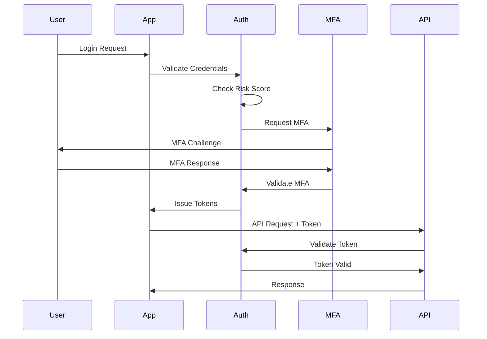

# Security Policy

## Table of Contents

1. [Security Overview](#security-overview)
2. [Security Architecture](#security-architecture)
3. [Reporting Security Vulnerabilities](#reporting-security-vulnerabilities)
4. [Security Controls](#security-controls)
5. [Data Protection](#data-protection)
6. [Authentication & Authorization](#authentication--authorization)
7. [Security Best Practices](#security-best-practices)
8. [Compliance & Standards](#compliance--standards)
9. [Security Monitoring](#security-monitoring)
10. [Incident Response](#incident-response)
11. [Security Training](#security-training)
12. [Third-Party Security](#third-party-security)

## Security Overview

SolarVoice AI Platform implements enterprise-grade security controls to protect sensitive solar construction data, voice communications, and business operations. Our security framework follows a defense-in-depth approach with multiple layers of protection.

### Core Security Principles

- **Zero Trust Architecture**: Never trust, always verify
- **Principle of Least Privilege**: Minimal access rights for users and services
- **Defense in Depth**: Multiple security layers
- **Security by Design**: Security integrated throughout development lifecycle
- **Continuous Monitoring**: Real-time threat detection and response

## Security Architecture

### Infrastructure Security

#### Network Security
- **Firewall Configuration**: Web Application Firewall (WAF) with custom rules
- **Network Segmentation**: Isolated VPCs for production, staging, and development
- **DDoS Protection**: CloudFlare/AWS Shield for traffic filtering
- **VPN Access**: Site-to-site VPN for administrative access
- **SSL/TLS**: TLS 1.3 minimum for all connections

#### Container Security
- **Image Scanning**: Automated vulnerability scanning for Docker images
- **Runtime Protection**: AppArmor/SELinux policies enforced
- **Secret Management**: HashiCorp Vault for credential storage
- **Network Policies**: Kubernetes NetworkPolicy for pod-to-pod communication

#### Cloud Security
- **IAM Policies**: Granular AWS/GCP IAM roles and policies
- **Resource Encryption**: All storage encrypted at rest
- **Key Management**: AWS KMS/GCP KMS for encryption keys
- **Backup Security**: Encrypted backups with versioning

### Application Security

#### Secure Development Lifecycle
- **SAST**: Static Application Security Testing in CI/CD
- **DAST**: Dynamic Application Security Testing for APIs
- **Dependency Scanning**: Automated vulnerability detection
- **Code Reviews**: Mandatory security-focused code reviews
- **Security Testing**: Penetration testing quarterly

#### API Security
- **Authentication**: OAuth 2.1 with PKCE
- **Rate Limiting**: Adaptive rate limiting per endpoint
- **Input Validation**: Schema validation for all inputs
- **Output Encoding**: Context-aware output encoding
- **CORS Policy**: Strict origin validation

## Reporting Security Vulnerabilities

The SolarVoice AI team takes security seriously. We appreciate your efforts to responsibly disclose your findings.

### Reporting Process

**DO NOT** create public GitHub issues for security vulnerabilities.

Instead, please report security vulnerabilities by emailing:
**security@solarvoice.ai**

Include the following information:
- Type of issue (e.g., buffer overflow, SQL injection, XSS)
- Full paths of source files related to the issue
- Location of the affected source code (tag/branch/commit or direct URL)
- Any special configuration required to reproduce the issue
- Step-by-step instructions to reproduce the issue
- Proof-of-concept or exploit code (if possible)
- Impact of the issue
- CVSS score estimate (if applicable)

### Response Timeline

- **Initial Response**: Within 48 hours
- **Status Update**: Within 5 business days
- **Resolution Target**: 
  - Critical (CVSS 9.0-10.0): 7 days
  - High (CVSS 7.0-8.9): 14 days
  - Medium (CVSS 4.0-6.9): 30 days
  - Low (CVSS 0.1-3.9): 90 days

### Security Advisories

Published security advisories can be found at:
- GitHub Security Advisories: https://github.com/solarvoice/platform/security/advisories
- Security Portal: https://security.solarvoice.ai/advisories

## Security Controls

### Access Controls

#### Multi-Factor Authentication (MFA)
- **Required for**: All administrative accounts
- **Methods Supported**:
  - TOTP (Google Authenticator, Authy)
  - WebAuthn/FIDO2
  - SMS backup (with warnings)
  - Biometric authentication (mobile apps)

#### Role-Based Access Control (RBAC)
```yaml
Roles:
  - SUPER_ADMIN: Full system access
  - ORG_ADMIN: Organization-level administration
  - PROJECT_MANAGER: Project management capabilities
  - CREW_CHIEF: Crew and field operations
  - INSTALLER: Field worker access
  - VIEWER: Read-only access
```

#### Attribute-Based Access Control (ABAC)
- Time-based restrictions
- Location-based access
- Device trust levels
- Risk-based authentication

### Session Management

- **Session Timeout**: 24 hours (configurable per organization)
- **Concurrent Sessions**: Limited to 5 per user
- **Session Revocation**: Immediate revocation capability
- **Device Fingerprinting**: Browser and device tracking
- **Secure Cookies**: httpOnly, secure, sameSite=strict

## Data Protection

### Encryption Standards

#### Data at Rest
- **Database**: AES-256-GCM encryption
- **File Storage**: AES-256 with unique keys per file
- **Backups**: AES-256 with key rotation
- **Key Management**: HSM-backed key storage

#### Data in Transit
- **TLS Version**: Minimum TLS 1.3
- **Cipher Suites**: ECDHE-RSA-AES256-GCM-SHA384 preferred
- **Certificate Pinning**: Mobile applications
- **Perfect Forward Secrecy**: Enabled

### Data Classification

| Classification | Description | Security Requirements |
|----------------|-------------|----------------------|
| **Critical** | API keys, passwords, financial data | Encrypted, audit logged, restricted access |
| **Sensitive** | PII, project details, voice recordings | Encrypted, access controlled |
| **Internal** | Business logic, configurations | Access controlled |
| **Public** | Marketing content, documentation | Standard protections |

### Data Retention

- **Voice Recordings**: 90 days (configurable)
- **Audit Logs**: 2 years
- **User Data**: As per GDPR/CCPA requirements
- **Backups**: 30-day rotation

## Authentication & Authorization

### Authentication Flow



### Token Management

- **Access Token**: 15-minute expiry
- **Refresh Token**: 30-day expiry with rotation
- **Token Storage**: Secure storage only
- **Token Revocation**: Immediate blacklisting

### Password Policy

- **Minimum Length**: 12 characters
- **Complexity**: Upper, lower, number, special character
- **History**: Cannot reuse last 12 passwords
- **Expiry**: 90 days (configurable)
- **Lockout**: 5 failed attempts = 30-minute lockout

## Security Best Practices

### For Developers

1. **Secure Coding Guidelines**
   ```javascript
   // Input Validation Example
   const validateInput = (input) => {
     const schema = Joi.object({
       projectId: Joi.string().uuid().required(),
       name: Joi.string().max(255).required(),
       data: Joi.object().required()
     });
     return schema.validate(input);
   };
   ```

2. **Secret Management**
   ```yaml
   # Never commit secrets
   # Use environment variables
   DATABASE_URL=${DATABASE_URL}
   JWT_SECRET=${JWT_SECRET}
   API_KEY=${API_KEY}
   ```

3. **Dependency Security**
   ```bash
   # Regular security audits
   npm audit
   npm audit fix
   
   # Dependency updates
   npm update --save
   ```

4. **Error Handling**
   ```javascript
   // Never expose internal errors
   try {
     await riskyOperation();
   } catch (error) {
     logger.error('Operation failed', { error, context });
     throw new AppError('Operation failed', 500);
   }
   ```

### For Operations

1. **Infrastructure Hardening**
   - Disable unnecessary services
   - Regular OS patching
   - Firewall rules review
   - Access log monitoring

2. **Monitoring Configuration**
   - Security event correlation
   - Anomaly detection rules
   - Alert thresholds
   - Incident escalation

3. **Backup Security**
   - Encrypted backups
   - Secure transfer
   - Access controls
   - Regular restore testing

## Compliance & Standards

### Regulatory Compliance

- **GDPR**: EU data protection compliance
- **CCPA**: California privacy compliance
- **SOC 2 Type II**: In progress
- **ISO 27001**: Planned for 2025
- **NIST Cybersecurity Framework**: Adopted

### Industry Standards

- **OWASP Top 10**: Protection against common vulnerabilities
- **CIS Controls**: Implementation of critical security controls
- **PCI DSS**: Payment card data security (if applicable)

### Compliance Checklist

- [ ] Data Processing Agreements (DPA) in place
- [ ] Privacy Policy updated
- [ ] Cookie consent implemented
- [ ] Data retention policies enforced
- [ ] Right to deletion capability
- [ ] Data portability features
- [ ] Breach notification procedures

## Security Monitoring

### Real-Time Monitoring

#### Security Information and Event Management (SIEM)
- **Log Aggregation**: Centralized logging from all services
- **Correlation Rules**: Automated threat detection
- **Alerting**: Real-time security alerts
- **Dashboard**: Security metrics visualization

#### Key Security Metrics

| Metric | Target | Alert Threshold |
|--------|--------|----------------|
| Failed Login Attempts | < 0.1% | > 1% |
| API Error Rate | < 0.5% | > 2% |
| Suspicious IP Blocks | < 100/day | > 500/day |
| Security Patch Time | < 7 days | > 14 days |
| Incident Response Time | < 1 hour | > 4 hours |

### Threat Intelligence

- **IP Reputation**: Real-time IP threat feeds
- **Vulnerability Feeds**: CVE monitoring
- **Industry Alerts**: Solar industry specific threats
- **Dark Web Monitoring**: Credential leak detection

## Incident Response

### Incident Response Plan

#### 1. Detection & Analysis
- Automated detection via SIEM
- Manual reporting channels
- Severity classification
- Impact assessment

#### 2. Containment
- Immediate threat isolation
- System quarantine if needed
- Evidence preservation
- Communication protocols

#### 3. Eradication
- Root cause analysis
- Vulnerability patching
- Malware removal
- System hardening

#### 4. Recovery
- System restoration
- Service validation
- Performance monitoring
- User communication

#### 5. Post-Incident
- Incident report
- Lessons learned
- Process improvements
- Training updates

### Emergency Contacts

```yaml
Security Team:
  Primary: security@solarvoice.ai
  Emergency: +1-XXX-XXX-XXXX
  On-Call: security-oncall@solarvoice.ai

Escalation:
  Level 1: Security Team Lead
  Level 2: CTO
  Level 3: CEO
```

## Security Training

### Developer Training

- **Secure Coding**: Quarterly workshops
- **OWASP Top 10**: Annual certification
- **Security Tools**: Hands-on training
- **Incident Response**: Tabletop exercises

### User Training

- **Security Awareness**: Monthly tips
- **Phishing Simulation**: Quarterly tests
- **Password Security**: Best practices
- **Social Engineering**: Recognition training

## Third-Party Security

### Vendor Assessment

- **Security Questionnaire**: Required for all vendors
- **SOC 2 Reports**: Annual review
- **Penetration Tests**: Results review
- **Insurance**: Cyber liability verification

### Integration Security

- **API Security**: OAuth 2.0 required
- **Data Sharing**: Encrypted channels only
- **Access Reviews**: Quarterly audits
- **Monitoring**: Third-party access logs

### Critical Third-Party Services

| Service | Purpose | Security Measures |
|---------|---------|------------------|
| AWS | Cloud Infrastructure | IAM, KMS, CloudTrail |
| Retell AI | Voice Processing | End-to-end encryption |
| ElevenLabs | Voice Synthesis | API key rotation |
| Stripe | Payments | PCI compliance |
| SendGrid | Email | DKIM, SPF, DMARC |

## Security Checklist for Deployments

### Pre-Deployment
- [ ] Security scan completed
- [ ] Dependency vulnerabilities resolved
- [ ] Environment variables secured
- [ ] Access controls configured
- [ ] SSL certificates valid

### Deployment
- [ ] Deployment through CI/CD only
- [ ] Automated security tests passed
- [ ] Configuration validation
- [ ] Rollback plan ready
- [ ] Monitoring alerts configured

### Post-Deployment
- [ ] Security monitoring active
- [ ] Performance baselines established
- [ ] Incident response team notified
- [ ] Documentation updated
- [ ] User communications sent

## Supported Versions

| Version | Supported | Security Updates | End of Life |
|---------|-----------|------------------|-------------|
| 2.0.x | :white_check_mark: | Active | TBD |
| 1.5.x | :white_check_mark: | Active | July 2025 |
| 1.0.x | :warning: | Critical only | March 2025 |
| < 1.0 | :x: | None | Ended |

## Contact

- **Security Team**: security@solarvoice.ai
- **Bug Bounty Program**: bounty@solarvoice.ai
- **Security Portal**: https://security.solarvoice.ai
- **PGP Key**: Available at https://solarvoice.ai/.well-known/pgp-key.asc

---

**Last Updated**: January 4, 2025
**Next Review**: April 4, 2025
**Document Version**: 2.0